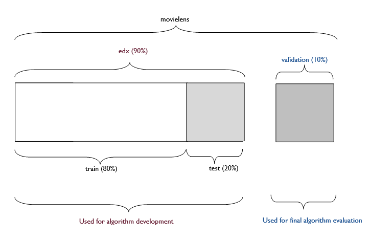

```{r setup, include = FALSE}

# Load setup
knitr::opts_chunk$set(
  echo = FALSE,
  message = FALSE,
  warning = FALSE
)
```

\newpage

# Introduction

## Recommendation systems

Recommendation or recommender systems (RS) are technologies that make predictions and subsequently recommend items to a user [@pu2011user]. These recommendations, such as what item to purchase or what movie to watch, may be based on aggregates of a large number of user preferences, e.g., ratings, a recommendation technique known as *collaborative filtering* [@zhou2008large]. RSs are used by well-known companies, like Netflix, YouTube, and Amazon, with the goal of increasing user engagement [@silveira2019good].

Measures of a good RS include high predictive accuracy, i.e., how close the RS's predictions are to the true ratings. Accuracy-based metrics for assessing and evaluating an RS's performance include root/residual mean square error (RMSE).

## GroupLens and MovieLens

GroupLens, a research laboratory in the Department of Computer Science and Engineering at the University of Minnesota, was one of the pioneers of research focusing on RSs. This group of researchers created several recommendation services, including [MovieLens](https://movielens.org/), a well-known movie recommendation website that uses *collaborative filtering* to make movie recommendations to users. The [MovieLens 10M data set](https://grouplens.org/datasets/movielens/10m/), used for this project, consists of 10,000,054 ratings of 10,681 movies by 71,567 users of the MovieLens recommender service.

## Capstone project

This report was created for the MovieLens Project, one of two Capstone projects required to fulfill the [HarvardX Data Science Professional Certificate series](https://learning.edx.org/course/course-v1:HarvardX+PH125.9x+1T2022/home). The stated aim of the project was to develop a movie recommendation system using the MovieLens 10M data set by training a machine learning algorithm to predict movie ratings. To measure the quality of the fit of the model, RMSE was used. The target for this project was to achieve **RMSE \< 0.86490** when comparing predicted movie ratings to true ratings in the final hold-out test (*validation* set).

To achieve this, the course instructor provided a code to download and combine the original 10M MovieLens data sets into a *movielens* data set, which was then split into 2 data sets: i) **edx** data set (*90%* of *movielens*), used to generate the movie recommendation algorithm, and; ii) **validation** data set (*10%* of *movielens*), *only* used with the final algorithm to predict movie ratings and compute the final project RMSE.

Before building the algorithm, data exploration of the *edx* data set was conducted to examine the different components of the data and assess their effects on rating. *edx* was then split into the *train* and *test* sets that were used to train a rating prediction algorithm. Linear regression models were created and trained by adding variable effects, one at a time, until an RMSE close to the target RMSE was obtained. The model with the lowest RMSE was then regularised, resulting in a model with an RMSE value less than the target RMSE. This final, regularised, model was finally used to predict ratings in the *validation* set and to compute the final model RMSE, which was also below the target RMSE.

The documents submitted for assessment of this project are: i) a report in R markdown format; ii) a report in PDF file format (knit from the Rmd file), and; iii) a script in R format that generates predicted movie ratings and RMSE score.

# Methods

## Data Cleaning, Exploration and Visualization

```{r, Create edx, set and validation set (final hold-out test set), cache=TRUE}

###################################################################################
# Download MovieLens 10M data, create *edx* and *validation* data sets
###################################################################################

# Use code provided by course instructor to download MovieLens 10M data and create edx data set (90% of data) and validation data set (10% of data)

if (!require(tidyverse)) install.packages("tidyverse", repos = "http://cran.us.r-project.org")
if (!require(caret)) install.packages("caret", repos = "http://cran.us.r-project.org")
if (!require(data.table)) install.packages("data.table", repos = "http://cran.us.r-project.org")

library(tidyverse)
library(caret)
library(data.table)

dl <- tempfile()
download.file("https://files.grouplens.org/datasets/movielens/ml-10m.zip", dl)

ratings <- fread(
  text = gsub("::", "\t", readLines(unzip(dl, "ml-10M100K/ratings.dat"))),
  col.names = c("userId", "movieId", "rating", "timestamp")
)

movies <- str_split_fixed(readLines(unzip(dl, "ml-10M100K/movies.dat")), "\\::", 3)
colnames(movies) <- c("movieId", "title", "genres")

# if using R 4.0 or later:
movies <- as.data.frame(movies) %>% mutate(
  movieId = as.numeric(movieId),
  title = as.character(title),
  genres = as.character(genres)
)

movielens <- left_join(ratings, movies, by = "movieId")

# Validation set will be 10% of MovieLens data
set.seed(1, sample.kind = "Rounding") # Set.seed for reproducibility
test_index <- createDataPartition(y = movielens$rating, times = 1, p = 0.1, list = FALSE)
edx <- movielens[-test_index, ]
temp <- movielens[test_index, ]

# Make sure userId and movieId in validation set are also in edx set
validation <- temp %>%
  semi_join(edx, by = "movieId") %>%
  semi_join(edx, by = "userId")

# Add rows removed from validation set back into edx set
removed <- anti_join(temp, validation)
edx <- rbind(edx, removed)

rm(dl, ratings, movies, test_index, temp, movielens, removed)
```

```{r, R packages}

###################################################################################
# Install other required packages and load libraries
###################################################################################

if (!require(kableExtra)) install.packages("kableExtra", repos = "http://cran.us.r-project.org")
if (!require(tinytex)) install.packages("tinytex", repos = "http://cran.us.r-project.org")
if (!require(knitr)) install.packages("knitr", repos = "http://cran.us.r-project.org")
if (!require(yaml)) install.packages("yaml", repos = "http://cran.us.r-project.org")
if (!require(naniar)) install.packages("naniar", repos = "http://cran.us.r-project.org")
if (!require(gridExtra)) install.packages("gridExtra", repos = "http://cran.us.r-project.org")
if (!require(tidyverse)) install.packages("tidyverse", repos = "http://cran.us.r-project.org")
if (!require(caret)) install.packages("caret", repos = "http://cran.us.r-project.org")
if (!require(rmarkdown)) install.packages("rmarkdown", repos = "http://cran.us.r-project.org")
if (!require(lubridate)) install.packages("lubridate", repos = "http://cran.us.r-project.org")
if (!require(scales)) install.packages("scales", repos = "http://cran.us.r-project.org")
if (!require(grid)) install.packages("grid", repos = "http://cran.us.r-project.org")

library(kableExtra)
library(tinytex)
library(knitr)
library(yaml)
library(naniar)
library(gridExtra)
library(tidyverse)
library(caret)
library(rmarkdown)
library(lubridate)
library(scales)
library(grid)
```

```{r, Custom theme, color palette, include = FALSE}

###################################################################################
# Create custom plot theme for all plots in the report
###################################################################################

theme_1 <- function() {
  font <- "sans" # assign family font
  theme_classic() %+replace% # modify from base theme
    theme(
      plot.title = element_text(
        family = font,
        size = 10,
        face = "bold",
        hjust = 0,
        vjust = 2
      ),
      axis.title = element_text(
        family = font,
        size = 8
      ),
      axis.text = element_text(
        family = font,
        size = 7
      ),
      legend.position = "top",
      legend.key.size = unit(0.35, "cm"),
      legend.title = element_text(
        size = 8
      ),
      plot.caption = element_text(
        size = 6,
        hjust = 1
      )
    )
}
```

```{r, data set-dimensions}

# Explore data
###################################################################################

# View dimensions for edx and validation data sets
edx_dim <- dim(edx)
validation_dim <- dim(validation)
```

Using code provided by the course instructor, the original MovieLens 10M data set files were downloaded, and used to generate the **movielens** data set, which was then divided into 2 as shown in Figure \@ref(fig:data-figure):

-   **edx** data set, which consisted of *90%* of data *(`r format(edx_dim[1], big.mark = ",")`* observations) from the *movielens* data set and was used to generate the recommendation algorithm, and;
-   **validation** data set, which consisted of *10%* of data *(`r format(validation_dim[1], big.mark = ",")`* observations) from the *movielens* data set and was *only* used with the final algorithm to predict movie ratings and compute final project RMSE.

The above splitting was done in a way that ensured that users and movies in the *validation* set were also present in the *edx* set. The **edx** set was later divided into the **train** and **test** sets in the modeling approach section.

```{r, data-figure, fig.cap = "Allocation of data", fig.height = 1, fig.width = 2.5}


```

```{r, structure}

# Create table showing edx classes and the first 10 observations
rbind(
  lapply(edx, class),
  head(edx, 10)
) %>%
  kbl(
    caption = "Overview of edx data set",
    booktabs = TRUE
  ) %>%
  kable_classic(
    latex_options = c("hold_position", "striped", "scale_down"),
    font_size = 8
  ) %>%
  row_spec(0, bold = T) %>%
  pack_rows("Class", 1, 1) %>%
  pack_rows("First 10 observations", 2, 11)
```

To get a general idea of the contents of the data, further exploration was carried out **only** **on *edx* data set** --- the *validation* data set was only introduced in the [Final algorithm validation](#final-algorithm-validation-1) section. First, the overall structure of *edx* was examined to learn more about the data set's variables and variable attributes (Table \@ref(tab:structure)). Each row in the data set is a rating given by one user at a particular point in time, for one movie that was released in a particular year and is categorized under one or more genres. The data set consists of 6 variables whose attributes are as follows:

-   **userId**: Unique identifier for each user
-   **movieId**: Unique identifier for each movie
-   **rating**: A 10-scale rating from 0.5 to 5 (in increments of 0.5) made for a movie by a user
-   **timestamp**: Date and time when rating was made (in seconds since January 1, 1970)
-   **title**: Movie title and year of release
-   **genres**: Genre(s) associated with a movie

```{r, Missing values - edx, include = FALSE}

# Check whether edx data set has any missing values
gg_miss_var(edx) +
  theme_1() +
  labs(
    title = "Missing values in edx data set",
    x = "Variables",
    y = "Number or missing values"
  )
```

Further examination revealed that *edx* did not contain any missing values. However, as every user in the data set did *not* rate every movie in the data set, the resulting user-movie matrix, whose entries indicate whether the user in a certain row rated the movie in a certain column, was sparse. According to @boe2007collaborative, sparsity level is defined as

$$
1 - \frac{number\;of\;nonzero\;entries}{total\;number\;of\;entries}
$$

```{r, Sparsity}

# All users did not rate all movies - compute the sparsity of the user-movie matrix

# Compute nonzero entries (i.e., total number of ratings in edx)
nonzero_entries <- nrow(edx)

# Compute total entries (i.e., total ratings if all users had rated all movies)

# Compute number of distinct users
distinct_users <- edx %>%
  distinct(userId) %>%
  nrow()

# Compute number of distinct movies
distinct_movies <- edx %>%
  distinct(movieId) %>%
  nrow()
# Compute total entries
tot_entries <- distinct_movies * distinct_users

# Compute sparsity
sparsity <- 1 - (nonzero_entries / tot_entries)
```

*edx* contains `r format(nonzero_entries, big.mark = ",")` distinct ratings given by `r format(distinct_users, big.mark = ",")` users for `r format(distinct_movies, big.mark = ",")` movies. The sparsity of *edx* was `r round(sparsity, digits = 3)` as shown below:

$$
1-\frac{9000055}{69878*10677} = 0.988
$$

Thus, for every 1000 observations in the user-movie matrix, 988 are missing. Figure \@ref(fig:Sparsity-matrix) shows part of the *edx* user-movie matrix, consisting of a random sample of 50 movies and 50 users, to illustrate its sparsity.

```{r, Sparsity-matrix, fig.cap = "User-movie matrix containing 50 movies and users from edx", fig.height = 4,  fig.width = 4}
  
# Create user movie matrix (for 50 users and 50 movies) showing whether a user in a certain row rated a movie in a certain column, to show how sparse this matrix is.

# Select a sample of 50 users
set.seed(1, sample.kind = "Rounding") # Set.seed for reproducibility
users <- sample(unique(edx$userId), 50)

# Select the movieIDs and ratings for all 50 users from edx
edx %>%
  filter(userId %in% users) %>%
  select(userId, movieId, rating) %>%
  mutate(rating = 1) %>%
  pivot_wider(
    names_from = movieId,
    values_from = rating
  ) %>%
  select(userId, sample(ncol(.), 50)) %>%
  # selecta sample of 50 movies
  pivot_longer(-1,
    names_to = "movieId",
    values_to = "rating"
  ) %>%
  mutate(
    rating = replace_na(rating, 0),
    rating = ifelse(rating == 1, "Yes", "No")
  ) %>%
  ggplot(aes(as.factor(movieId), as.factor(userId))) +
  geom_tile(aes(fill = rating),
                color = "grey50",
    alpha = 0.5
  ) +
  scale_fill_manual(values = c("white", "#205493")) +
  labs(
    caption = "Source: MovieLens 10M Dataset",
    x = "Movies",
    y = "Users",
    fill = "Movie rated?"
  ) +
  scale_x_discrete(guide = guide_axis(angle = 90)) +
  theme_1() +
  theme(
    axis.text.x = element_text(size = 5),
    axis.text.y = element_text(size = 5)
  )
```

Each of the 6 variables was analysed further below.

### Rating

```{r, Rating-summary}

# Explore *rating* column
###################################################################################

# A. Summary for *rating* column:

# Summarise rating column (include mean, sd, 1st & 3rd quartile)
summ_rating <- edx %>%
  summarise(
    min = min(rating),
    mean = round(mean(rating), digits = 2),
    sd = round(sd(rating), digits = 2),
    q_1st = quantile(rating, probs = 25 / 100),
    median = median(rating),
    q_3rd = quantile(rating, probs = 75 / 100),
    max = max(rating)
  )
```

The *rating* column contained the outcome variable, rating score. It used a scale ranging from `r summ_rating$min` to `r summ_rating$max` stars, including half-star ratings. The mean of rating score in *edx* was `r summ_rating$mean` and the standard deviation was `r summ_rating$sd`. Figure \@ref(fig:Rating-scores) shows that the most common rating score was `r edx %>% group_by(rating) %>% tally() %>% slice_max(n) %>% pull(rating)` and the least common was `r edx %>% group_by(rating) %>% tally() %>% slice_min(n) %>% pull(rating)`. Whole star ratings (1, 2, 3, 4, 5) were more prevalent at `r edx %>% filter(rating %in% c(1, 2, 3, 4, 5)) %>% summarise(prop = round((nrow(.) / nrow(edx)) * 100, digits = 1)) %>% pull(prop) %>% paste0(., "%")` than half star ratings (0.5, 1.5, 2.5, 3.5, 4.5) at `r edx %>% filter(rating %in% c(0.5, 1.5, 2.5, 3.5, 4.5)) %>% summarise(prop = round((nrow(.) / nrow(edx)) * 100, digits = 1)) %>% pull(prop) %>% paste0(., "%")`. This was likely because the first whole star rating was given in `r edx %>% filter(rating %in% c(1, 2, 3, 4, 5)) %>% slice_min(timestamp) %>% slice_sample(n = 1) %>% mutate(timestamp = lubridate::year(as_datetime(timestamp))) %>% filter(timestamp == timestamp[1]) %>% pull(timestamp)`, while the first half-star rating was 8 years later, in `r edx %>% filter(rating %in% c(0.5, 1.5, 2.5, 3.5, 4.5)) %>% slice_min(timestamp) %>% slice_sample(n = 1) %>% mutate(timestamp = lubridate::year(as_datetime(timestamp))) %>% filter(timestamp == timestamp[1]) %>% pull(timestamp)`.

```{r, Rating-scores, fig.cap = "Distribution of rating scores ", fig.height = 3.5}

# B. Distribution of *rating* column:

# Plot distribution of rating scores
edx %>%
  group_by(rating) %>%
  summarise(
    n = n(),
    star = ifelse(rating %in% c(1, 2, 3, 4, 5),
      "Whole star", "Half star"
    )
  ) %>%
  # Remove duplicates
  filter(!duplicated(rating)) %>%
  ungroup() %>%
  ggplot(aes(rating, n, fill = star)) +
  geom_col(alpha = 0.5) +
  labs(
    caption = "Source: MovieLens 10M data set",
    x = "Rating score",
    y = "Number of ratings",
    fill = "Type"
  ) +
  # Show number of ratings per score
  geom_text(aes(
    label = format(n, big.mark = ","),
    vjust = -0.5
  ),
  size = 2.5,
  alpha = 0.5
  ) +
  scale_x_continuous(breaks = breaks_pretty(n = 10)) +
  scale_y_continuous(
    label = scales::comma,
    breaks = breaks_pretty(n = 6)
  ) +
  # Add line showing median rating score
  geom_vline(
    xintercept = summ_rating$median,
    linetype = "dashed",
    alpha = 0.5,
    color = "black"
  ) +
  geom_label(aes(4.25, 3000000),
    label = paste0("Median = ", summ_rating$median),
    color = "grey50",
    fill = "white",
    size = 2
  ) +
  # Add standard deviation of rating scores
  annotate("text",
    x = 1.5,
    y = 2000000,
    size = 2,
    color = "grey50",
    label = str_c(
      "1st Quartile = ", summ_rating$q_1st,
      "\n Mean = ", summ_rating$mean,
      "\n Std. Dev. = ", summ_rating$sd,
      "\n 3rd Quartile = ", summ_rating$q_3rd
    )
  ) +
  scale_fill_manual(values = c("#651D32", "#205493")) +
  theme_1() +
  theme(
    legend.key.size = unit(0.5, "cm")
  )
```

### Movie

```{r, Distinct-movies}

# Explore *movieId* column
###################################################################################

# A. Summary for *movieId* column:

# Number of ratings

# Summarise number of ratings per movie (min, mean, sd, median, max)
summ_movie_rating <- edx %>%
  group_by(movieId) %>%
  summarise(n = n()) %>%
  summarise(
    min = min(n),
    mean = mean(n),
    sd = sd(n),
    median = median(n),
    max = max(n)
  )

# Rating scores

# Summarise average rating score per movie (min, mean, sd, median, max)
summ_movie_score <- edx %>%
  group_by(movieId) %>%
  summarise(avg_score = mean(rating)) %>%
  summarise(
    min = min(avg_score),
    mean = mean(avg_score),
    sd = sd(avg_score),
    median = median(avg_score),
    max = max(avg_score)
  )

# B. Compute coefficient of variation (CV)

# Number of ratings per movie
cv_movie_rating <- summ_movie_rating %>%
  summarise(cv = sd / mean) %>%
  pull(cv) %>%
  round(2)

# Average rating score per movie
cv_movie_score <- summ_movie_score %>%
  summarise(cv = sd / mean) %>%
  pull(cv) %>%
  round(2)
```

The *movieId* column of *edx* contained a total of `r format(distinct_movies, big.mark = ",")` distinct movies. The distributions of number of ratings[^1] (Figure \@ref(fig:Movie-column)A) and average ratings scores (Figure \@ref(fig:Movie-column)B) across movies showed slightly positive and negative skewness, respectively. The top 10% of movies, by number of ratings, had `r slice_max(edx %>% group_by(movieId) %>% summarise(n = n()), order_by = n, prop = .10) %>% pull(n) %>% min() %>% format(big.mark = ",")` ratings or more, while the bottom 10% had `r slice_min(edx %>% group_by(movieId) %>% summarise(n = n()), order_by = n, prop = .10) %>% pull(n) %>% max()` ratings or fewer. A majority of movies with the highest possible or the lowest possible average rating scores had a very small sample size (i.e., they were only rated by a single user). The mean number of ratings per movie was `r round(summ_movie_rating$mean, 0)` ($\pm$ `r round(summ_movie_rating$sd, 0) %>% format(big.mark = ",")`). The average rating score per movie was `r round(summ_movie_score$mean, 2)` ($\pm$ `r round(summ_movie_score$sd, 3)`). The coefficient of variation (CV) for the number of ratings was `r cv_movie_rating` and the CV for the average rating score was `r cv_movie_score`[^2]. Thus, the number of ratings had more variation, relative to their mean, compared to the average rating score.

[^1]: Note that the number of ratings for each movie is equal to the number of users who rated the movie.

[^2]: The coefficient of variation (CV) is defined as a ratio of the standard deviation to the mean [@lovie2005coefficient]. It allows for comparison of the variation in number of ratings and the average rating score.

```{r, Movie-column, fig.cap = " Distribution of number of ratings (A) and average rating scores (B) across movies", fig.height = 3.5}

# C. Distribution for *movieId* column:

# Number of ratings

# Plot distribution of number of ratings across movies
ratings_m <- edx %>%
  group_by(movieId) %>%
  summarise(n = n()) %>%
  ggplot(aes(n)) +
  geom_histogram(
    binwidth = 0.1,
    fill = "#205493",
    color = "white",
    alpha = 0.5
  ) +
  geom_density(aes(y = ..count.. * 0.1),
    color = "#651D32"
  ) +
  # Add line showing median rating per movie
  geom_vline(
    xintercept = summ_movie_rating$median,
    linetype = "dashed",
    color = "black"
  ) +
  geom_label(aes(500, 475),
    label = paste0("Median = ", round(summ_movie_rating$median, 0)),
    color = "grey50",
    fill = "white",
    size = 2
  ) +
  # Show min, mean, standard deviation & max
  annotate("text",
    x = 10000,
    y = 350,
    size = 2,
    color = "grey50",
    label = str_c(
      "Minimum = ", summ_movie_rating$min,
      "\n Mean = ", round(summ_movie_rating$mean, 0),
      "\n Std. Dev. = ", format(round(summ_movie_rating$sd, 0),
        big.mark = ","
      ),
      "\n Maximum = ", format(summ_movie_rating$max,
        big.mark = ","
      )
    )
  ) +
  scale_x_log10(label = scales::comma) +
  labs(
    title = "A",
    x = "Number of ratings",
    y = "Number of movies"
  ) +
  theme_1()

# Rating scores

# Plot distribution of average rating scores across movies
scores_m <- edx %>%
  group_by(movieId) %>%
  summarise(avg_score = mean(rating)) %>%
  ggplot(aes(avg_score)) +
  geom_histogram(
    binwidth = 0.1,
    fill = "#205493",
    color = "white",
    alpha = 0.5
  ) +
  geom_density(aes(y = ..count.. * 0.1),
    color = "#651D32"
  ) +
  # Add line showing median average rating score per movie
  geom_vline(
    xintercept = summ_movie_score$median,
    linetype = "dashed",
    color = "black"
  ) +
  geom_label(aes(2.7, 850),
    label = paste0("Median = ", round(summ_movie_score$median, 2)),
    color = "grey50",
    fill = "white",
    size = 2
  ) +
  # Show min, mean, standard deviation & max
  annotate("text",
    x = 1.5,
    y = 600,
    size = 2,
    color = "grey50",
    label = str_c(
      "Minimum = ", summ_movie_score$min,
      "\n Mean = ", round(summ_movie_score$mean, 2),
      "\n Std. Dev. = ", round(summ_movie_score$sd, 3),
      "\n Maximum = ", summ_movie_score$max
    )
  ) +
  labs(
    title = "B",
    x = "Average rating score",
    y = "Number of movies"
  ) +
  theme_1()

# Plot the 2 graphs on one layout
grid.arrange(ratings_m, scores_m,
  ncol = 2,
  bottom = textGrob("Source: MovieLens 10M data set",
    hjust = 1,
    x = 1,
    gp = gpar(fontsize = 6)
  )
)
```

Furthermore, only a handful of movies received either very many or very few ratings. For example, the top 5 movies, by number of ratings received, had over 28,000 ratings each (Table \@ref(tab:Movies-Top-Bottom)). The movie with the highest number of ratings was *`r edx %>% group_by(movieId) %>% summarise(n = n(), title = title) %>% ungroup() %>% slice_max(order_by = n) %>% distinct(title) %>% pull(title)`*, which received `r edx %>% group_by(movieId) %>% summarise(n = n()) %>% slice_max(order_by = n) %>% pull(n) %>% format(, big.mark = ",")` ratings. `r edx %>% group_by(movieId) %>% summarise(n = n()) %>% slice_min(order_by = n) %>% nrow()` movies received the lowest possible number of ratings, a rating of only `r edx %>% group_by(movieId) %>% summarise(n = n()) %>% min()` each. Average rating scores were more variable among movies rated only once compared to movies with the highest number of ratings (Table \@ref(tab:Movies-Top-Bottom)).

```{r, Movies-Top-Bottom}

# D. Best and worst movies - number of ratings / average rating scores:

# Top and bottom 5 movies by number of ratings and their corresponding average rating scores

# Top 5 most rated movies - number of ratings
top_5 <- edx %>%
  group_by(movieId) %>%
  summarise(
    title = title,
    num = n(),
    avg_rating = mean(rating)
  ) %>%
  distinct(movieId, .keep_all = TRUE) %>%
  ungroup() %>%
  slice_max(
    order_by = num,
    n = 5
  )

# 5 of the least rated movies - number of ratings
bottom_5 <- edx %>%
  group_by(movieId) %>%
  summarise(
    title = title,
    num = n(),
    avg_rating = mean(rating)
  ) %>%
  distinct(movieId, .keep_all = TRUE) %>%
  ungroup() %>%
  slice_min(
    order_by = num,
    n = 5 # returns all 126 movies which were rated only once
  ) %>%
  slice_sample(n = 5) # randomly select only five of these least rated movies

# Combine the top and bottom movies into a table with number of ratings and average rating scores for each
rbind(top_5, bottom_5) %>%
  mutate(
    num = format(num, big.mark = ","),
    avg_rating = round(avg_rating, 2)
  ) %>%
  select(-movieId) %>%
  kbl(
    caption = "Top and bottom movies by number of ratings",
    col.names = c("Title (Release year)", "Number of ratings", "Average rating score"),
    booktabs = TRUE
  ) %>%
  kable_classic(
    latex_options = c("hold_position", "striped"),
    font_size = 8
  ) %>%
  row_spec(0, bold = T) %>%
  pack_rows("Most rated", 1, 5) %>%
  pack_rows("Least rated", 6, 10) %>%
  footnote(symbol = "The edx data set contained 126 movies rated by a single user (i.e., 'least rated'). Only 5 of these are shown in this table.")
```

### User

```{r, Distinct-users}

# Explore *userId* column
###################################################################################

# A. Summary for *userId* column:

# Number of ratings

# Summarise number of ratings per user (min, mean, sd, median, max)
summ_user_rating <- edx %>%
  group_by(userId) %>%
  summarise(n = n()) %>%
  summarise(
    min = min(n),
    mean = mean(n),
    sd = sd(n),
    median = median(n),
    max = max(n)
  )

# Rating scores

# Summarise average rating score per user (min, mean, sd, median, max)
summ_user_score <- edx %>%
  group_by(userId) %>%
  summarise(avg_score = mean(rating)) %>%
  summarise(
    min = min(avg_score),
    mean = mean(avg_score),
    sd = sd(avg_score),
    median = median(avg_score),
    max = max(avg_score)
  )

# B. Compute coefficient of variation (CV)

# Number of ratings per user
cv_user_rating <- summ_user_rating %>%
  summarise(cv = sd / mean) %>%
  pull(cv) %>%
  round(2)

# Average rating score per user
cv_user_score <- summ_user_score %>%
  summarise(cv = sd / mean) %>%
  pull(cv) %>%
  round(3)
```

The *edx* data set constisted of `r format(distinct_users, big.mark = ",")` distinct users, each uniquely identified by a *userId*. The distributions of the number of ratings[^3] (Figure \@ref(fig:User-column)A) and average ratings scores (Figure \@ref(fig:User-column)B) across users showed positive and negative skewness, respectively. On average, users rated `r edx %>% group_by(userId) %>% summarise(n = n()) %>%  distinct(userId, .keep_all = TRUE) %>% summarise(avg_rating = round(mean(n), digits = 0)) %>% pull(avg_rating)` ($\pm$ `r edx %>% group_by(userId) %>% summarise(n = n()) %>%  distinct(userId, .keep_all = TRUE) %>% summarise(sd = round(sd(n), digits = 0)) %>% pull(sd)`) times. A majority of users (`r edx %>% group_by(userId) %>% summarise(n = n()) %>% filter(n < 1000) %>% summarise(prop = round((nrow(.) / 69878) * 100, 1)) %>% pull(prop)`%) rated less than 1,000 movies overall. Only a handful of users rated either very many or very few movies e.g., the top 5 users, by number of ratings, rated over 4,000 movies while the bottom 5 rated 14 movies or less, each (Table \@ref(tab:Users-Top-Bottom)). The user with the highest number of ratings had `r format(edx %>% group_by(userId) %>% summarise(n = n()) %>% slice_max(order_by = n) %>% pull(n), big.mark = ",")` ratings while the user with the lowest number of ratings had `r edx %>% group_by(userId) %>% summarise(n = n()) %>% slice_min(order_by = n) %>% pull(n)` ratings. `r edx %>% group_by(userId) %>% summarise(avg_rating = mean(rating)) %>% filter(avg_rating <= 0.5) %>% nrow()` users gave the lowest possible average rating score, `r min(edx$rating)`, while `r format(edx %>% group_by(userId) %>% summarise(avg_rating = mean(rating)) %>% filter(avg_rating == 5) %>% nrow(), big.mark = ",")` users gave the highest possible average rating score, `r max(edx$rating)`. The CV for the number of ratings was `r cv_user_rating` and the CV for the average rating score was `r cv_user_score`. Thus, the number of ratings had more variation, relative to their mean, compared to the average rating score.

[^3]: The number of ratings for each user is equal to the number of movies that the user rated.

```{r, User-column, fig.cap = "Distribution of number of ratings (A) and average rating scores (B) across users", fig.height = 3.5}

# C. Distribution for *userId* column:

# Number of ratings

# Plot distribution of number of ratings across users
ratings_u <- edx %>%
  group_by(userId) %>%
  summarise(n = n()) %>%
  ggplot(aes(n)) +
  geom_histogram(
    binwidth = 0.1,
    fill = "#205493",
    color = "white",
    alpha = 0.5
  ) +
  geom_density(aes(y = ..count.. * 0.1),
    color = "#651D32"
  ) +
  # Add line showing median
  geom_vline(
    xintercept = summ_user_rating$median,
    linetype = "dashed",
    color = "black"
  ) +
  geom_label(aes(140, 7000),
    label = paste0("Median = ", round(summ_user_rating$median, 0)),
    color = "grey50",
    fill = "white",
    size = 2
  ) +
  # Show min, mean, standard deviation & max
  annotate("text",
    x = 1000,
    y = 5000,
    size = 2,
    color = "grey50",
    label = str_c(
      "Minimum = ", summ_user_rating$min,
      "\n Mean = ", round(summ_user_rating$mean, 0),
      "\n Std. Dev. = ", round(summ_user_rating$sd, 0),
      "\n Maximum = ", format(summ_user_rating$max,
        big.mark = ","
      )
    )
  ) +
  scale_x_log10(label = scales::comma) +
  labs(
    title = "A",
    caption = "",
    x = "Number of ratings",
    y = "Number of users"
  ) +
  theme_1()

# Rating scores

# Plot distribution of average rating scores across users
scores_u <- edx %>%
  group_by(userId) %>%
  summarise(avg_rating = mean(rating)) %>%
  ggplot(aes(avg_rating)) +
  geom_histogram(
    binwidth = 0.1,
    fill = "#205493",
    color = "white",
    alpha = 0.5
  ) +
  geom_density(aes(y = ..count.. * 0.1),
    color = "#651D32"
  ) +
  # Add line showing median
  geom_vline(
    xintercept = summ_user_score$median,
    linetype = "dashed",
    color = "black"
  ) +
  geom_label(aes(3.1, 7000),
    label = paste0("Median: ", round(summ_user_score$median, 2)),
    color = "grey50",
    fill = "white",
    size = 2
  ) +
  # Show min, mean, standard deviation & max
  annotate("text",
    x = 1.5,
    y = 5000,
    size = 2,
    color = "grey50",
    label = str_c(
      "Minimum = ", summ_user_score$min,
      "\n Mean = ", round(summ_user_score$mean, 2),
      "\n Std. Dev. = ", round(summ_user_score$sd, 3),
      "\n Maximum = ", summ_user_score$max
    )
  ) +
  labs(
    title = "B",
    x = "Average rating score",
    y = "Number of users"
  ) +
  theme_1()

# Plot the 2 graphs on one layout
grid.arrange(ratings_u, scores_u,
  ncol = 2,
  bottom = textGrob("Source: MovieLens 10M data set",
    hjust = 1,
    x = 1,
    gp = gpar(fontsize = 6)
  )
)
```

```{r, Users-Top-Bottom}

# D. Top and bottom users - number of ratings / average rating scores:

# Top 5 users by number of ratings
top_5 <- edx %>%
  group_by(userId) %>%
  summarise(
    num = n(),
    avg_rating = mean(rating)
  ) %>%
  distinct(userId, .keep_all = TRUE) %>%
  ungroup() %>%
  slice_max(
    order_by = num,
    n = 5
  )

# Bottom users by number of ratings
bottom_5 <- edx %>%
  group_by(userId) %>%
  summarise(
    num = n(),
    avg_rating = mean(rating)
  ) %>%
  distinct(userId, .keep_all = TRUE) %>%
  ungroup() %>%
  slice_min(
    order_by = num,
    n = 5
  ) %>% # Results in all 28 users with the lowest number of ratings
  slice(1:5) # Select a sample of 5 from users with lowest number of ratings

# Combine the top and bottom users and create a table
rbind(top_5, bottom_5) %>%
  mutate(
    num = format(num, big.mark = ","),
    avg_rating = round(avg_rating, 2)
  ) %>%
  kbl(
    caption = "Top and bottom users by number of ratings",
    col.names = c("User ID", "Number of ratings", "Average rating score"),
    booktabs = TRUE
  ) %>%
  kable_classic(
    latex_options = c("hold_position", "striped"),
    font_size = 8
  ) %>%
  row_spec(0, bold = T) %>%
  pack_rows("Most frequent raters", 1, 5) %>%
  pack_rows("Least frequent raters", 6, 10)
```

### Genre

```{r, Original-categories, fig.cap = "Distributions of number of ratings (A) and average rating scores (B) across original genre categories", fig.height = 3.5}

# Explore *genres* column
###################################################################################

# A. Explore original genre categories (797 categories)

# 1. Summary

# Summarise number of ratings per original genre category
g_avg_rating <- edx %>%
  group_by(genres) %>%
  summarise(n = n()) %>%
  summarise(
    min = min(n),
    mean = mean(n),
    sd = sd(n),
    median = median(n),
    max = max(n)
  )

# Summarise average rating score per original genre category
g_avg_score <- edx %>%
  group_by(genres) %>%
  summarise(avg_score = mean(rating)) %>%
  summarise(
    min = min(avg_score),
    mean = mean(avg_score),
    sd = sd(avg_score),
    median = median(avg_score),
    max = max(avg_score)
  )

# 2. Compute coefficient of variation (CV)

# CV for number of ratings per original genre category
cv_g_rating <- g_avg_rating %>%
  summarise(cv = sd / mean) %>%
  pull(cv) %>%
  round(2)

# CV for average rating score per original genre category
cv_g_score <- g_avg_score %>%
  summarise(cv = sd / mean) %>%
  pull(cv) %>%
  round(3)

# 3. Distributions for number of ratings and average rating score

# Plot distribution of number of ratings across original genre categories
ratings_g <- edx %>%
  group_by(genres) %>%
  summarise(n = n()) %>%
  ggplot(aes(n)) +
  geom_histogram(
    binwidth = 0.1,
    fill = "#205493",
    color = "white",
    alpha = 0.5
  ) +
  geom_density(aes(y = ..count.. * 0.1),
    color = "#651D32"
  ) +
  # Add line showing median rating per original genre category
  geom_vline(
    xintercept = g_avg_rating$median,
    linetype = "dashed",
    color = "black"
  ) +
  geom_label(aes(275, 40),
    label = paste0("Median = ", round(g_avg_rating$median, 0)),
    color = "grey50",
    fill = "white",
    size = 2
  ) +
  # Show min, mean, standard deviation & max
  annotate("text",
    x = 90,
    y = 30,
    size = 2,
    color = "grey50",
    label = str_c(
      "Minimum = ", g_avg_rating$min,
      "\n Mean = ", round(g_avg_rating$mean, 0),
      "\n Std. Dev. = ", format(round(g_avg_rating$sd, 0),
        big.mark = ","
      ),
      "\n Maximum = ", format(g_avg_rating$max,
        big.mark = ","
      )
    )
  ) +
  scale_x_log10(label = scales::comma) +
  labs(
    title = "A",
    x = "Number of ratings",
    y = "Number of original genre categories"
  ) +
  theme_1()

# Plot distribution of average rating scores across original genre categories
scores_g <- edx %>%
  group_by(genres) %>%
  summarise(avg_score = mean(rating)) %>%
  ggplot(aes(avg_score)) +
  geom_histogram(
    binwidth = 0.1,
    fill = "#205493",
    color = "white",
    alpha = 0.5
  ) +
  geom_density(aes(y = ..count.. * 0.1),
    color = "#651D32"
  ) +
  # Add line showing median average rating score per original genre category
  geom_vline(
    xintercept = g_avg_score$median,
    linetype = "dashed",
    color = "black"
  ) +
  geom_label(aes(3, 80),
    label = paste0("Median = ", round(g_avg_score$median, 2)),
    color = "grey50",
    fill = "white",
    size = 2
  ) +
  # Show min, mean, standard deviation & max
  annotate("text",
    x = 2,
    y = 40,
    size = 2,
    color = "grey50",
    label = str_c(
      "Minimum = ", round(g_avg_score$min, 2),
      "\n Mean = ", round(g_avg_score$mean, 2),
      "\n Std. Dev. = ", round(g_avg_score$sd, 3),
      "\n Maximum = ", round(g_avg_score$max, 2)
    )
  ) +
  labs(
    title = "B",
    x = "Average rating score",
    y = "Number of original genre categories"
  ) +
  theme_1()

# Plot the 2 graphs on one layout
grid.arrange(ratings_g, scores_g,
  ncol = 2,
  bottom = textGrob("Source: MovieLens 10M data set",
    hjust = 1,
    x = 1,
    gp = gpar(fontsize = 6)
  )
)
```

The *genre* column contained, for each movie, all the different genres that it could be associated with, resulting in some movies being classified under multiple genres e.g., *`r edx$title[1]`* was assigned to the genres *`r edx$genres[1]`* (see Table \@ref(tab:structure)). 3 genre categories were considered.

#### Original genre categories

The data set contained `r edx %>% group_by(genres) %>% distinct(genres) %>% nrow()` of these original genre categories, including a *'no genres listed'* category. As this latter category only had only one movie, it was discarded, during modeling, and only `r edx %>% group_by(genres) %>% distinct(genres) %>% nrow() - 1` original genre categories were considered. Figure \@ref(fig:Original-categories) shows the distributions for the number of ratings (A) and average rating scores (B) across the original genre categories. The CV for the number of ratings across original genre categories was `r cv_g_rating`, while the CV for the average rating scores `r cv_g_score`.

```{r, Number-of-genres-categories, fig.cap = "Distributions of number of movies (A) and number of ratings and average rating scores (B) across number-of-genres categories", fig.height = 3.5}

# B. Explore number-of-genre categories

# Create modified edx dataset with a column (n_genres) for categories based on the number of genres a movie is categorized under
edx_n_genres <- edx %>%
  filter(!genres == "(no genres listed)") %>% # Remove 'no genres listed' category
  mutate(n_genres = paste0(str_count(genres, "\\|") + 1, "-genre"))

# 1. Summary

# Summarise number of ratings per number-of-genre category (1-genre, 2-genre, etc)
gc_avg_rating <- edx_n_genres %>%
  group_by(n_genres) %>%
  summarise(n = n()) %>%
  summarise(
    mean = mean(n),
    sd = sd(n)
  )

# Summarise average rating score per number-of-genre category (1-genre, 2-genre, etc)
gc_avg_score <- edx_n_genres %>%
  group_by(n_genres) %>%
  summarise(avg_score = mean(rating)) %>%
  summarise(
    mean = mean(avg_score),
    sd = sd(avg_score)
  )

# 2. Compute coefficient of variation (CV)

# Number of ratings per number-of-genre category (1-genre, 2-genre, etc)
cv_gc_rating <- gc_avg_rating %>%
  summarise(cv = sd / mean) %>%
  pull(cv) %>%
  round(2)

# Average rating score per number-of-genre category (1-genre, 2-genre, etc)
cv_gc_score <- gc_avg_score %>%
  summarise(cv = sd / mean) %>%
  pull(cv) %>%
  round(4)

# 3. Distributions for number of ratings and average rating score

# Plot distribution of movies across number-of-genre categories
gc_movies <- edx_n_genres %>%
  group_by(n_genres) %>%
  distinct(movieId, .keep_all = TRUE) %>%
  summarise(n = n()) %>%
  ggplot(aes(
    n,
    reorder(n_genres, n,
      decreasing = FALSE
    )
  )) +
  geom_col(
    fill = "#205493",
    color = "white",
    alpha = 0.5
  ) +
  geom_text(aes(
    label = format(n, big.mark = ","),
    hjust = -0.25
  ),
  size = 2.5
  ) +
  labs(
    title = "A",
    x = "Number of movies",
    y = "Number of genres per category"
  ) +
  scale_y_discrete() +
  scale_x_continuous(
    label = scales::comma,
    limits = c(0, 5000)
  ) +
  theme_1()

# Plot distribution of number of ratings and average rating scores across number-of-genre categories
gc_ratings <- edx_n_genres %>%
  group_by(n_genres) %>%
  summarise(
    n = n(),
    avg_score = mean(rating)
  ) %>%
  ggplot() +
  geom_col(aes(
    x = n,
    y = reorder(n_genres, n,
      decreasing = FALSE
    )
  ),
  fill = "#205493",
  color = "white",
  alpha = 0.5
  ) +
  geom_point(aes(
    x = avg_score * 600000,
    y = n_genres
  ),
  color = "#651D32"
  ) +
  labs(
    title = "B"
  ) +
  scale_y_discrete(name = "Number of genres per category") +
  scale_x_continuous(
    label = label_number(
      suffix = "M",
      scale = 1e-6
    ),
    name = "Number of ratings",
    breaks = breaks_pretty(n = 5),
    sec.axis = sec_axis(
      trans = ~ . / 600000,
      name = "Average rating score"
    )
  ) +
  theme_1() +
  theme(
    axis.title.x = element_text(color = "#205493"),
    axis.title.x.top = element_text(color = "#651D32"),
    axis.text.x = element_text(color = "#205493"),
    axis.text.x.top = element_text(color = "#651D32")
  )

# Plot graphs together
grid.arrange(gc_movies, gc_ratings,
  ncol = 2,
  bottom = textGrob("Source: MovieLens 10M data set",
    hjust = 1,
    x = 1,
    gp = gpar(fontsize = 6)
  )
)
```

#### Number-of-genres categories

Here, genres were categorized as 1-, 2-, 3-,4-, 5-, 6-, 7-, and 8-genre categories, based on the number of genres. For examples, genres *Comedy\|Romance* and *Action\|Thriller* were categorised as 2-genre, and *Action\|Crime\|Thriller* and *Action\|Adventure\|Sci-Fi*, as 3-genre. Figure \@ref(fig:Number-of-genres-categories)A shows the distribution of movies across number-of-genres categories. `r edx_n_genres %>% filter(n_genres == "1-genre") %>% distinct(movieId) %>% nrow() %>% format(., big.mark = ",")` movies (`r paste0(round(edx_n_genres %>% filter(n_genres == "1-genre") %>% distinct(movieId) %>% nrow() / distinct_movies * 100, digits = 1), "%")` of all movies) were categorized as 1-genre movies and the rest, `r edx_n_genres %>% filter(!n_genres == "1-genre") %>% distinct(movieId) %>% nrow() %>% format(., big.mark = ",")` movies (`r paste0(round(edx %>% filter(str_detect(genres, "\\|")) %>% distinct(movieId) %>% nrow(.) / distinct_movies * 100, digits = 1), "%")` of all movies) were categorized under multiple genres. 1-, 2- and 3-genre categories contained `r edx_n_genres %>% filter(n_genres %in% c("1-genre", "2-genre", "3-genre")) %>% distinct(movieId) %>% nrow() %>% format(., big.mark = ",")` movies, (`r paste0(round(edx_n_genres %>% filter(n_genres %in% c("1-genre", "2-genre", "3-genre")) %>% distinct(movieId) %>% nrow() / distinct_movies * 100, digits = 1), "%")` of all movies) (Figure \@ref(fig:Number-of-genres-categories)A).

Data was explored to assess variation in number of ratings and average rating scores across number-of-genre categories (Figure \@ref(fig:Number-of-genres-categories)B). Large variations in number of ratings were noted, with the 3-genre category having the highest number of ratings, `r edx_n_genres %>% group_by(n_genres) %>% summarise(n = n()) %>% slice_max(n) %>% pull(n) %>% format(, big.mark = ",")`, (`r paste0(round(edx_n_genres %>% group_by(n_genres) %>% summarise(n = n()) %>% slice_max(n) %>% summarise(p = n / nrow(edx) * 100) %>% pull(p), digits = 1), "%")` of all ratings) and the 8-genre category the lowest, `r edx_n_genres %>% group_by(n_genres) %>% summarise(n = n()) %>% slice_min(n) %>% pull(n)` (`r paste0(edx_n_genres %>% group_by(n_genres) %>% summarise(n = n()) %>% slice_min(n) %>% summarise(p = n / nrow(edx) * 100) %>% pull(p) %>% round(., digits = 4) %>% format(., scientific = FALSE), "%")` of all ratings). The CV for the number of ratings across number-of-genre categories was `r cv_gc_rating`. Lower variation in average rating scores was noticed, with the 5-genre category having the highest average rating score, `r edx_n_genres %>% group_by(n_genres) %>% summarise(avg_score = mean(rating)) %>% slice_max(avg_score) %>% pull(avg_score) %>% round(., digits = 2)`, and the 6-genre category the lowest, `r edx_n_genres %>% group_by(n_genres) %>% summarise(avg_score = mean(rating)) %>% slice_min(avg_score) %>% pull(avg_score) %>% round(., digits = 2)` (Figure \@ref(fig:Number-of-genres-categories)B). The CV for the average rating score across number-of-genre categories was `r cv_gc_score`.

```{r, Individual-genres, fig.cap = "Distributions of number of movies (A) and number of ratings and average rating scores (B) per individual genre", fig.height = 3.5}

# C. Explore individual genres - distinct genres from original genre categories

# Create modified edx data set with individual genres extracted into individual rows
edx_genres <- edx %>%
  separate_rows(genres,
    sep = "\\|"
  ) %>%
  filter(!genres == "(no genres listed)") # Remove  'no genres listed' category

# 1. Summary

# Summarise number of ratings per individual genre (Action. Drama, etc)
gi_avg_rating <- edx_genres %>%
  group_by(genres) %>%
  summarise(n = n()) %>%
  summarise(
    mean = mean(n),
    sd = sd(n)
  )

# Summarise average rating score per individual genre (Action. Drama, etc)
gi_avg_score <- edx_genres %>%
  group_by(genres) %>%
  summarise(avg_score = mean(rating)) %>%
  summarise(
    mean = mean(avg_score),
    sd = sd(avg_score)
  )

# 2. Compute coefficient of variation (CV)

# Number of ratings per individual genre (Action. Drama, etc)
cv_gi_rating <- gi_avg_rating %>%
  summarise(cv = sd / mean) %>%
  pull(cv) %>%
  round(3)

# Average rating score per individual genre (Action. Drama, etc)
cv_gi_score <- gi_avg_score %>%
  summarise(cv = sd / mean) %>%
  pull(cv) %>%
  round(4)

# 3. Distributions for number of ratings and average rating score

# Plot distribution of movies across individual genres
gi_movies <- edx_genres %>%
  group_by(genres) %>%
  distinct(movieId, .keep_all = TRUE) %>%
  summarise(n = n()) %>%
  ggplot(aes(
    n,
    reorder(genres, n,
      decreasing = FALSE
    )
  )) +
  geom_col(
    fill = "#205493",
    color = "white",
    alpha = 0.5
  ) +
  geom_text(aes(
    label = format(n, big.mark = ","),
    hjust = -0.25
  ),
  size = 2.5
  ) +
  labs(
    title = "A",
    x = "Number of movies",
    y = "Individual genres"
  ) +
  scale_x_continuous(
    label = scales::comma,
    limits = c(0, 6000),
    breaks = breaks_pretty(n = 6)
  ) +
  scale_y_discrete() +
  theme_1()

# Plot distribution of number of ratings and average rating scores across individual genres
gi_ratings <- edx_genres %>%
  group_by(genres) %>%
  summarise(
    n = n(),
    avg_score = mean(rating)
  ) %>%
  ggplot(aes(
    n,
    reorder(genres, n,
      decreasing = FALSE
    )
  )) +
  geom_col(
    fill = "#205493",
    color = "white",
    alpha = 0.5
  ) +
  geom_point(aes(x = avg_score * 800000),
    color = "#651D32"
  ) +
  labs(
    title = "B"
  ) +
  scale_y_discrete(name = "Individual genre") +
  scale_x_continuous(
    label = label_number(
      suffix = "M",
      scale = 1e-6
    ),
    name = "Number of ratings",
    breaks = breaks_pretty(n = 5),
    sec.axis = sec_axis(
      trans = ~ . / 600000,
      name = "Average rating score"
    )
  ) +
  theme_1() +
  theme(
    axis.title.x = element_text(color = "#205493"),
    axis.title.x.top = element_text(color = "#651D32"),
    axis.text.x = element_text(color = "#205493"),
    axis.text.x.top = element_text(color = "#651D32")
  )

# Plot graphs together
grid.arrange(gi_movies, gi_ratings,
  ncol = 2,
  bottom = textGrob("Source: MovieLens 10M data set",
    hjust = 1,
    x = 1,
    gp = gpar(fontsize = 6)
  )
)
```

#### Individual genres

From the original genre categories in *edx*, individual genres were extracted, resulting in `r edx_genres %>% distinct(genres) %>% nrow()` categories, including the *'no genres listed'* category.[^4] Figure \@ref(fig:Individual-genres)A shows the distribution of movies across individual genres.[^5] The distribution of the number of movies across individual genres revealed that `r edx_genres %>% group_by(genres) %>% distinct(movieId, .keep_all = TRUE) %>% summarise(n = n()) %>% slice_max(n, n = 1) %>% pull(genres)` had the most number of movies, `r edx_genres %>% group_by(genres) %>% distinct(movieId, .keep_all = TRUE) %>% summarise(n = n()) %>% slice_max(n, n = 1) %>% pull(n) %>% format(., big.mark = ",")`, while `r edx_genres %>% group_by(genres) %>%  distinct(movieId, .keep_all = TRUE) %>% summarise(n = n()) %>% slice_min(n, n = 1) %>% pull(genres)` had the least, `r edx_genres %>% group_by(genres) %>%  distinct(movieId, .keep_all = TRUE) %>% summarise(n = n()) %>% slice_min(n, n = 1) %>% pull(n)`.

[^4]: It was noted that according to the [MovieLens 10M Readme file](https://files.grouplens.org/datasets/movielens/ml-10m-README.html), the data set consisted of only 18 distinct genres. *IMAX*, included here as the 19th genre, was not listed on the file. `r edx_genres %>% filter(genres == "IMAX") %>% distinct(movieId) %>% nrow()` movies were found to be assigned to the *IMAX* genre and `r edx %>% filter(genres == "(no genres listed)") %>% distinct(movieId) %>% nrow()` movie had no genre listed. For this analysis, *IMAX* was retained as the 19th genre to keep the corresponding movies.

[^5]: Note that movie-user combinations are represented multiple times in Figure \@ref(fig:Individual-genres). For example, the movie, `r edx$title[1]`, which is categorized under the genres, `r  edx$genres[1]`, and was rated `r edx$rating[1]` by user `r edx$userId[1]` will be counted twice, under both individual genres *Comedy* and *Romance,* for this user.

Variation in the number of ratings and average rating scores across individual genres was also analysed. Figure \@ref(fig:Individual-genres)B showed that *`r edx_genres %>% group_by(genres) %>% summarise(n = n()) %>% slice_max(order_by = n) %>% pull(genres)`* had the highest number of ratings, `r edx_genres %>% group_by(genres) %>% summarise(n = n()) %>% slice_max(order_by = n) %>% pull(n) %>% format(, big.mark = ",")`, while *`r edx_genres %>% group_by(genres) %>% summarise(n = n()) %>% filter(!genres == "(no genres listed)") %>% slice_min(order_by = n) %>% pull(genres)`* had the lowest, `r format(edx_genres %>% group_by(genres) %>% summarise(n = n()) %>% filter(!genres == "(no genres listed)") %>% slice_min(order_by = n) %>% pull(n), big.mark = ",")`. The CV for the number of ratings across individual genres was `r cv_gi_rating`. There was less variation in average rating scores across distinct genres. *`r edx_genres %>% group_by(genres) %>% summarise(n = n(), avg_rating = round(mean(rating), 2)) %>% slice_max(order_by = avg_rating) %>% pull(genres)`* had the highest average rating score, `r edx_genres %>% group_by(genres) %>% summarise(n = n(), avg_rating = round(mean(rating), 2)) %>% slice_max(order_by = avg_rating) %>% pull(avg_rating)`, while *`r edx_genres %>% group_by(genres) %>% summarise(n = n(), avg_rating = round(mean(rating), 2)) %>% slice_min(order_by = avg_rating) %>% pull(genres)`* had the lowest average rating score of `r edx_genres %>% group_by(genres) %>% summarise(n = n(), avg_rating = round(mean(rating), 2)) %>% slice_min(order_by = avg_rating) %>% pull(avg_rating)`. The CV for the rating scores across individual genres was `r cv_gi_score`.

### Movie title and release year

The *title* column consisted of a movie's title and year of release (e.g, `r edx$title[1]`).

```{r, Title column}

# Explore *title* column
###################################################################################

# A. Create release_year column

# Extract year of release from *title* column and save to release_year column
edx <- edx %>%
  extract(title,
    c("title", "release_year"),
    regex = "^(.*)\\s*\\(([0-9]*)\\)\\s*$"
  ) %>%
  mutate(release_year = as.numeric(release_year))

# B. Summary of release_year column:

# 1. Number of ratings
summ_release_year_rating <- edx %>%
  group_by(release_year) %>%
  summarise(
    n = n()
  ) %>%
  summarize(
    mean = mean(n),
    sd = sd(n),
    min = min(n),
    max = max(n)
  )

# 2. Average rating scores
summ_release_year_score <- edx %>%
  group_by(release_year) %>%
  summarise(
    avg_score = mean(rating)
  ) %>%
  summarize(
    mean = mean(avg_score),
    sd = sd(avg_score),
    min = min(avg_score),
    max = max(avg_score)
  )

# C. Compute coefficient of variation (CV) for release year

# 1. Number of ratings per year
cv_release_year_rating <- summ_release_year_rating %>%
  summarise(cv = sd / mean) %>%
  pull(cv) %>%
  round(2)

# 2. Average rating score per year
cv_release_year_score <- summ_release_year_score %>%
  summarise(cv = sd / mean) %>%
  pull(cv) %>%
  round(2)
```

Movie release years were extracted from the *title* column and explored. The oldest movie was released in `r min(edx$release_year)`. Only `r edx %>% filter(release_year == min(release_year)) %>% distinct(movieId) %>% nrow()` movie was released that year and it received `r edx %>% filter(release_year == min(release_year)) %>% summarise(n = n()) %>% pull(n)` ratings (from `r edx %>% filter(release_year == min(release_year)) %>% summarise(n = n()) %>% pull(n)` users) and had an average rating score of `r edx %>% filter(release_year == min(release_year)) %>% summarise(avg_score = round(mean(rating), digits = 2)) %>% pull(avg_score)`. The newest movies were released in `r max(edx$release_year)`. This year had `r edx %>% filter(release_year == max(release_year)) %>% distinct(movieId) %>% nrow()` movie releases, `r edx %>% filter(release_year == max(release_year)) %>% group_by(movieId) %>% summarise(n = n()) %>% summarise(tot = sum(n)) %>% pull(tot) %>% format(., big.mark = ",")` ratings from `r edx %>% filter(release_year == max(release_year)) %>% distinct(userId) %>% nrow() %>% format(., big.mark = ",")` distinct users, and an average rating score of `r edx %>% filter(release_year == max(release_year)) %>% summarise(avg_score = round(mean(rating), 2)) %>% pull(avg_score)`. Overall, there was a steady increase in number of ratings across years, which peaked in 1995, followed by a decline. The year with the highest possible number of ratings, `r edx %>% group_by(release_year) %>% summarise(n = n()) %>% slice_max(order_by = n) %>% pull(release_year)`, had `r edx %>% group_by(release_year) %>% summarise(n = n()) %>% slice_max(order_by = n) %>% pull(n) %>% format(big.mark = ",")` ratings, while the year with the lowest number of ratings, `r edx %>% group_by(release_year) %>% summarise(n = n()) %>% slice_min(order_by = n) %>% pull(release_year)`, had `r edx %>% group_by(release_year) %>% summarise(n = n()) %>% slice_min(order_by = n) %>% pull(n)` ratings. Across years, the average rating score did not appear to vary greatly. The lowest average rating score per year was `r edx %>% group_by(release_year) %>% summarise(avg_score = round(mean(rating), 2)) %>% slice_min(order_by = avg_score) %>% pull(avg_score)` in `r edx %>% group_by(release_year) %>% summarise(avg_score = mean(rating)) %>% slice_min(order_by = avg_score) %>% pull(release_year)`, while the highest was `r edx %>% group_by(release_year) %>% summarise(avg_score = round(mean(rating), 2)) %>% slice_max(order_by = avg_score) %>% distinct(avg_score) %>% pull(avg_score)` in the years `r edx %>% group_by(release_year) %>% summarise(avg_score = round(mean(rating), 2)) %>% slice_max(order_by = avg_score) %>% filter(release_year == min(release_year)) %>% pull(release_year)` and `r edx %>% group_by(release_year) %>% summarise(avg_score = round(mean(rating), 2)) %>% slice_max(order_by = avg_score) %>% filter(release_year == max(release_year)) %>% pull(release_year)` (Figure \@ref(fig:Release-year)). The CV for the number of ratings was `r cv_release_year_rating` and the CV for the average rating score was `r cv_release_year_score`.

```{r, Release-year, fig.cap = "Distribution of number of ratings and average rating scores by movie release year", fig.height = 3}

# D. Distribution across release_year column:

# Plot number of ratings and average rating scores across release years
edx %>%
  group_by(release_year) %>%
  summarise(
    n = n(),
    avg_score = mean(rating)
  ) %>%
  ggplot(aes(x = release_year)) +
  geom_col(aes(y = n),
    fill = "#205493",
    color = "white",
    alpha = 0.5
  ) +
  geom_point(aes(y = avg_score * 160000),
    color = "#651D32",
    alpha = 0.5
  ) +
  # Add a line to show mean yearly number of ratings
  geom_hline(
    yintercept = summ_release_year_rating$mean,
    linetype = "dashed",
    color = "#205493"
  ) +
  geom_label(aes(
    1920,
    110000
  ),
  label = paste0(
    "Mean yearly number \n of ratings: ",
    format(round(summ_release_year_rating$mean, 0),
      big.mark = ","
    )
  ),
  color = "#205493",
  fill = "white",
  size = 2
  ) +
  # Add a line to show average yearly rating score
  geom_hline(
    yintercept = summ_release_year_score$mean * 160000,
    linetype = "dashed",
    color = "#651D32"
  ) +
  geom_label(aes(
    2005,
    640000
  ),
  label = paste0(
    "Mean yearly \n rating score: ",
    round(summ_release_year_score$mean, 2)
  ),
  color = "#651D32",
  fill = "white",
  size = 2
  ) +
  labs(
    caption = "Source: MovieLens 10M data set",
    x = "Year of release",
    y = "Number of ratings"
  ) +
  scale_y_continuous(
    label = label_number(
      suffix = "k",
      scale = 1e-3
    ),
    name = "Number of ratings",
    sec.axis = sec_axis(
      trans = ~ . / 160000,
      name = "Average rating score"
    )
  ) +
  scale_x_continuous(
    guide = guide_axis(angle = 90),
    breaks = breaks_pretty(n = 31)
  ) +
  theme_1() +
  theme(
    axis.title.y.left = element_text(color = "#205493"),
    axis.title.y.right = element_text(color = "#651D32"),
    axis.text.y.left = element_text(color = "#205493"),
    axis.text.y.right = element_text(color = "#651D32")
  )
```

### User rating date and time

The *timestamp* column contained the date and time when a particular user rated a particular movie. The units shown are in seconds since midnight Coordinated Universal Time (UTC) of January 1, 1970 (e.g., `r edx$timestamp[1]`). These values were converted to a more understandable date and time format (i.e., `r edx %>% mutate(rating_date = round_date(as_datetime(timestamp), unit = "week")) %>% slice_head(n = 1) %>%  pull(rating_date )`). The earliest rating occured on `r min(edx %>% mutate(rating_date = round_date(as_datetime(timestamp), unit = "week")) %>% pull(rating_date[1]))` and the final rating on `r max(edx %>% mutate(rating_date = round_date(as_datetime(timestamp), unit = "week")) %>% pull(rating_date[1]))`.

```{r, timestamp, fig.cap = "Distribution of number of ratings and average rating scores per rating year", fig.height = 3}

# Explore *timestamp* column
###################################################################################

# A. Create rating_year column:

# Timestamp column units are seconds. Convert column to date & time format (with year as unit) and save this to new column *rating_date*.
edx <- edx %>%
  mutate(rating_year = round_date(as_datetime(timestamp),
    unit = "year"
  )) %>%
  select(-timestamp) # remove timestamp column

# B. Summary of rating_year column:

# Number of ratings
summ_rating_year_rating <- edx %>%
  group_by(rating_year) %>%
  summarise(
    n = n()
  ) %>%
  summarize(
    mean = mean(n),
    sd = sd(n),
    min = min(n),
    max = max(n)
  )

# Average rating scores
summ_rating_year_score <- edx %>%
  group_by(rating_year) %>%
  summarise(
    avg_score = mean(rating)
  ) %>%
  summarize(
    mean = mean(avg_score),
    sd = sd(avg_score),
    min = min(avg_score),
    max = max(avg_score)
  )

# C. Compute coefficient of variation (CV) for rating_year

# 1. Number of ratings per year
cv_rating_year_rating <- summ_rating_year_rating %>%
  summarise(cv = sd / mean) %>%
  pull(cv) %>%
  round(2)

# 2. Average rating score per year
cv_rating_year_score <- summ_rating_year_score %>%
  summarise(cv = sd / mean) %>%
  pull(cv) %>%
  round(2)

# D. Distribution across new *date* column:

# Plot number of ratings and average rating scores across rating years
edx %>%
  group_by(rating_year) %>%
  summarise(
    n = n(),
    avg_score = mean(rating)
  ) %>%
  ggplot(aes(x = rating_year)) +
  geom_col(aes(y = n),
    fill = "#205493",
    color = "white",
    alpha = 0.5
  ) +
  geom_point(aes(y = avg_score * 240000),
    color = "#651D32"
  ) +
  geom_smooth(aes(y = avg_score * 240000),
    color = "#651D32"
  ) +
  labs(
    caption = "Source: MovieLens 10M data set",
    x = "Year of rating",
    y = "Number of ratings"
  ) +
  scale_y_continuous(
    label = scales::comma,
    name = "Number of ratings",
    sec.axis = sec_axis(
      trans = ~ . / 240000,
      name = "Average rating score"
    )
  ) +
  scale_x_datetime(
    guide = guide_axis(angle = 90),
    breaks = breaks_pretty(n = 14)
  ) +
  theme_1() +
  theme(
    axis.title.y.left = element_text(color = "#205493"),
    axis.title.y.right = element_text(color = "#651D32"),
    axis.text.y.left = element_text(color = "#205493"),
    axis.text.y.right = element_text(color = "#651D32")
  )
```

Across rating years the number of ratings varied greatly with the highest number of ratings (`r edx %>% group_by(rating_year) %>% summarise(n = n()) %>% slice_max(n, n = 1) %>% pull(n) %>% format(., big.mark = ",")`) observed in `r edx %>% group_by(rating_year) %>% summarise(n = n()) %>% slice_max(n, n = 1) %>% mutate(date_year = year(rating_year)) %>% pull(date_year)`, and the lowest (`r edx %>% group_by(rating_year) %>% summarise(n = n()) %>% slice_min(n, n = 1) %>% pull(n) %>% format(., big.mark = ",")`) in `r edx %>% group_by(rating_year) %>% summarise(n = n()) %>% slice_min(n, n = 1) %>% mutate(date_year = year(rating_year)) %>% pull(date_year)`. Average rating scores across rating years also varied with the highest rating score, `r edx %>% group_by(rating_year) %>% summarise(avg_score = mean(rating)) %>% slice_max(avg_score, n = 1) %>% pull(avg_score)`, observed in `r edx %>% group_by(rating_year) %>% summarise(avg_score = mean(rating)) %>% slice_max(avg_score, n = 1) %>% mutate(date_year = year(rating_year)) %>% pull(date_year)` and the lowest, `r edx %>% group_by(rating_year) %>% summarise(avg_score = mean(rating)) %>% slice_min(avg_score, n = 1) %>% pull(avg_score) %>% round(., digits = 2)`, in `r edx %>% group_by(rating_year) %>% summarise(avg_score = mean(rating)) %>% slice_min(avg_score, n = 1) %>% mutate(date_year = year(rating_year)) %>% pull(date_year)` (Figure \@ref(fig:timestamp)). The CV for the number of ratings was `r cv_rating_year_rating` and the CV for the average rating score was `r cv_rating_year_score`.

### Insights gained

The exploratory data analysis section above revealed variation in the number of ratings and the average rating scores across movies, users, genres, movie release year and user rating year. The CV for number of ratings and average rating score for each of these independent variables is shown in Table \@ref(tab:CV-table). Based on this table, the highest variability in rating score appeared across *movie*, *user*, and *genre - original combinations*, i.e., these were the variables with the highest CV for average rating score. As a result, these 3 variables were chosen to be added to the modeling approach. As the other variables had relatively lower CV for average rating score, they were excluded from the algorithm.

```{r, CV-table}

# Create table showing CV for number of ratings and average ratings scores for all variables

tibble(
  Variable = c(
    "Movie",
    "User",
    "Genre - original genre categories",
    "Genre - number-of-genres categories",
    "Genre - Individual genres",
    "Release year",
    "Rating date"
  ),
  CV_ratings = round(
    c(
      cv_movie_rating,
      cv_user_rating,
      cv_g_rating,
      cv_gc_rating,
      cv_gi_rating,
      cv_release_year_rating,
      cv_rating_year_rating
    ),
    4
  ),
  CV_avg_rating_score = round(c(
    cv_movie_score,
    cv_user_score,
    cv_g_score,
    cv_gc_score,
    cv_gi_score,
    cv_release_year_score,
    cv_rating_year_score
  ), 4)
) %>%
  kbl(
    caption = "Comparison of CV for number of ratings and average rating scores for all independent variables",
    col.names = c("Variable", "CV (Number of ratings)", "CV (Average rating score)"),
    booktabs = TRUE
  ) %>%
  kable_classic(
    latex_options = c("hold_position", "striped"),
    font_size = 8
  ) %>%
  row_spec(1:3, bold = TRUE)
```

```{r, Clear memory}

# Remove temp files and plots to conserve memory
rm(nonzero_entries, tot_entries, sparsity, users, summ_rating, summ_movie_rating, summ_movie_score, cv_movie_rating, cv_movie_score, ratings_m, scores_m, top_5, bottom_5, summ_user_rating, summ_user_score, cv_user_rating, cv_user_score, ratings_u, scores_u, edx_genres, edx_n_genres, g_avg_rating, g_avg_score, cv_g_rating, cv_g_score, ratings_g, scores_g, gc_avg_rating, gc_avg_score, cv_gc_rating, cv_gc_score, gc_movies, gc_ratings, gi_avg_rating, gi_avg_score, cv_gi_rating, cv_gi_score, gi_movies, gi_ratings, summ_release_year_rating, summ_release_year_score, cv_release_year_rating, cv_release_year_score, summ_rating_year_rating, summ_rating_year_score, cv_rating_year_rating, cv_rating_year_score)
```

## Modeling Approach

A multivariable linear regression modeling approach was chosen for prediction, given the modest target RMSE of \< 0.86490. Because of the sheer size of the MovieLens 10M data set, fitting a linear model in R, using the `lm()` function, was not feasible and was eschewed for all models. Instead, approximations were computed for each of the added variable effects.

```{r, modify edx}

# Modify edx data set for modeling - Keep only the columns needed for the modeling approach section
edx <- edx %>%
  select(movieId, userId, title, genres, rating) %>%
  # Remove observations with 'no genre listed' category
  filter(!genres == "(no genres listed)")
```

### *Train* and *test* sets

The algorithm was developed using *edx* data set, which was split into 2: i) *train* set, containing *80%* of *edx* data and used to generate the algorithm, and ii) *test* set, containing *20%* of *edx* data and used for initial testing of the algorithm (see Figure \@ref(fig:data-figure)). Splitting was done in a manner that ensured that the distribution of rating scores (stored in the *edx* outcome column, *rating)* in the *train* and *test* sets were balanced. An overview of the resulting 2 data sets is shown in Table \@ref(tab:Train-test-sets).

```{r, Train-test-sets}

# Split edx data set into train set (80%) and test set (20%)
set.seed(2000, sample.kind = "Rounding") # Set.seed for reproducibility
train_index <- createDataPartition(edx$rating, times = 1, p = 0.8, list = FALSE)
train_set <- edx[train_index, ]
test_set <- edx[-train_index, ]

# Make sure userId and movieId included in the test set is also in the train set
test_set_temp <- test_set %>%
  semi_join(train_set, by = "movieId") %>%
  semi_join(train_set, by = "userId")

# Add rows removed from test set back into train set and rename
removed <- anti_join(test_set, test_set_temp)
test_set <- test_set_temp
train_set <- rbind(train_set, removed)

# Remove all unnecessary files
rm(test_set_temp, removed, train_index)

# Tabulate dimensions of train and test set
data.frame(
  row.names = c("Train set", "Test set"),
  r_num = c(dim(train_set)[1], dim(test_set)[1]),
  prop = c(
    (nrow(train_set) / sum(nrow(train_set), nrow(test_set))),
    (nrow(test_set) / sum(nrow(train_set), nrow(test_set)))
  )
) %>%
  mutate(
    r_num = format(r_num, big.mark = ","),
    prop = paste(round(prop * 100, digits = 1), "%")
  ) %>%
  kbl(
    caption = "Dimensions and proportions of train and test sets",
    col.names = c("Number of rows", "Proportion of edx"),
    booktabs = TRUE
  ) %>%
  kable_classic(
    latex_options = c("hold_position", "striped"),
    font_size = 8
  )
```

### Loss Function

To assess the algorithm's adequacy to model the data, the accuracy-based measure, **root/residual mean square error (RMSE)**, was used as the loss function.

$$
RMSE =  \sqrt{\frac{1}{N}\sum_{u,m}(\hat{Y}_{u,m} - Y_{u,m})^2}
$$ where:

$Y_{u,m}$ = rating for movie, *m*, by user, *u*

$\hat{Y}_{u,m}$ = predicted rating

$N$ = number of user-movie combinations in the *test set* (when developing the algorithm) or *validation set* (when evaluating the final algorithm).

The goal for the project was to create a model which predicted ratings in the *validation* set with an RMSE of \< 0.86490.

```{r, RMSE}

# Function to compute RMSE for all models
RMSE <- function(true_ratings, predicted_ratings) {
  sqrt(mean((true_ratings - predicted_ratings)^2))
}
```

### Developing the algorithm

#### Baseline model

The baseline model of the algorithm was a naive model that set the predicted rating for each movie as *the average rating for all users across all movies*.\
$$
Y_{u,m} = \mu + \varepsilon_{u,m}
$$where:

$Y_{u,m}$ = rating for movie, *m*, by user, *u*

$\mu$ = average movie rating for all movies

$\varepsilon_{u,m}$ = independent errors sampled from the same distribution centred at 0.

To minimize the RMSE, the least squares estimate (LSE) of $\mu$ - i.e., the average rating across all movies and users - $\hat{\mu}$, was computed as follows:

$$
\hat{\mu} = \frac{1}{N} \sum_{u,m} Y_{u,m}
$$

where:

$N$ = total number of user-movie combinations

$Y_{u,m}$ = actual rating for movie *m* by user *u*

```{r, Baseline model}

# Compute average rating (mu_hat) for all movies across all users
mu_hat <- mean(train_set$rating)

# Compute RMSE for baseline model
avg_model_rmse <- RMSE(test_set$rating, mu_hat)
```

#### Baseline + Movie effects model {#baseline-movie-effects-model}

A movie effects term was added to the baseline model as follows:\
$$
Y_{u,m} = \mu + b_m + \varepsilon_{u,m}
$$where:

$Y_{u,m}$ = rating for movie, $m$, by user, *u*

$\mu$ = average movie rating for all movies

$b_m$ = movie-specific effects

$\varepsilon_{u,m}$ = independent errors

The "movie effect" for movie *m*, denoted as $\hat{b}_m$, was estimated as follows:

$$
\hat{b}_m = \frac{1}{N_m} \sum_{u = 1}^{N_m} (Y_{u,m} - \hat{\mu})
$$

where:

$N_m$ = number of users that rated movie *m*

$Y_{u,m}$ = actual rating for movie *m* by user *u*

$\hat{\mu}$ = average rating across all movies and users estimated in the [Baseline model] section

```{r, Movie effect estimates}

# Compute movie effect estimates
movie_effects <- train_set %>%
  group_by(movieId) %>%
  summarise(mov = mean(rating - mu_hat))

# Plot movie effect estimates
plot_m <- movie_effects %>%
  ggplot(aes(mov)) +
  geom_histogram(
    binwidth = 0.1,
    fill = "#205493",
    color = "white",
    alpha = 0.5
  ) +
  # Add line showing median rating
  geom_vline(
    xintercept = median(movie_effects$mov),
    linetype = "dashed",
    color = "black",
    show.legend = TRUE
  ) +
  geom_label(aes(-1, 810),
    label = paste0("Median = ", round(median(movie_effects$mov), 3)),
    color = "grey50",
    fill = "white",
    size = 2
  ) +
  annotate("text",
    x = -2.5,
    y = 600,
    size = 2,
    color = "grey50",
    label = str_c(
      "Minimum = ", round(min(movie_effects$mov), 2),
      "\n Mean = ", round(mean(movie_effects$mov), 3),
      "\n Std. Dev. = ", round(sd(movie_effects$mov), 3),
      "\n Maximum = ", round(max(movie_effects$mov), 2)
    )
  ) +
  labs(
    x = "Movie effect estimates",
    y = "Number of movies"
  ) +
  scale_y_continuous(limits = c(0, 820)) +
  theme_1()
```

```{r, Baseline + Movie effects model - predicted ratings and RMSE}

# Predict ratings in test set using Baseline + Movie effects model
predicted_ratings <- test_set %>%
  left_join(movie_effects, by = "movieId") %>%
  mutate(prediction = mu_hat + mov) %>%
  pull(prediction)

# Compute RMSE for Baseline + Movie effects model
movie_model_rmse <- RMSE(
  test_set$rating,
  predicted_ratings
)
```

#### Baseline + Movie + User effects model {#baseline-movie-user-effects-model}

A user effects term was incorporated into the model as follows:\
$$
Y_{u,m} = \mu + b_m + b_u + \varepsilon_{u,m}
$$ where:

$Y_{u,m}$ = rating for movie, $m$, by user, *u*

$\mu$ = average movie rating for all movies

$b_m$ = movie-specific effects

$b_u$ = user-specific effects

$\varepsilon_{u,m}$ = independent errors

The "user effect" for user *u*, denoted as $b_u$, was estimated using the equation:

$$
\hat{b}_u =  \frac{1}{N_u} \sum_{m = 1}^{N_u} (Y_{u,m} - \hat{\mu} - \hat{b}_m)
$$

where:

$N_u$ = number of movies rated by user *u*

$Y_{u,m}$ = actual rating for movie *m* by user *u*

$\hat{\mu}$ = average rating across all movies and users estimated in the [Baseline model] section

$\hat{b}_m$ = movie effect estimates computed in the [Baseline + Movie effects model](#baseline-movie-effects-model) section

```{r, User effect estimates}

# Compute user effect estimates
user_effects <- train_set %>%
  left_join(movie_effects, by = "movieId") %>%
  group_by(userId) %>%
  summarise(use = mean(rating - mu_hat - mov))

# Plot user effect estimates
plot_u <- user_effects %>%
  ggplot(aes(use)) +
  geom_histogram(
    binwidth = 0.1,
    fill = "#205493",
    color = "white",
    alpha = 0.5
  ) +
  # Add line showing mean rating
  geom_vline(
    xintercept = mean(user_effects$use),
    linetype = "dashed",
    color = "black",
    show.legend = TRUE
  ) +
  geom_label(aes(1, 7500),
    label = paste0("Median = ", round(median(user_effects$use), 4)),
    color = "grey50",
    fill = "white",
    size = 2
  ) +
  annotate("text",
    x = -2.5,
    y = 4000,
    size = 2,
    color = "grey50",
    label = str_c(
      "Minimum = ", round(min(user_effects$use), 2),
      "\n Mean = ", round(mean(user_effects$use), 4),
      "\n Std. Dev. =", round(sd(user_effects$use), 3),
      "\n Maximum = ", round(max(user_effects$use), 2)
    )
  ) +
  labs(
    x = "User effect estimates",
    y = "Number of users"
  ) +
  scale_y_continuous(limits = c(0, 8000)) +
  theme_1()
```

```{r, Baseline + Movie + User effects model - predicted ratings and RMSE}

# Predict ratings in test set using Baseline + Movie + User effects model
predicted_ratings <- test_set %>%
  left_join(movie_effects, by = "movieId") %>%
  left_join(user_effects, by = "userId") %>%
  mutate(prediction = mu_hat + mov + use) %>%
  pull(prediction)

# Compute RMSE for Baseline + Movie + User effects model
user_model_rmse <- RMSE(
  test_set$rating,
  predicted_ratings
)
```

#### Baseline + Movie + User + Genre effects model (Original genre categories)

The original genre categories were utilised for this model. The genre effects term was added to the model as follows:\
$$
Y_{u,m} = \mu + b_m + b_u + b_{g[m]} + \varepsilon_{u,m}
$$

where:

$Y_{u,m}$ = rating for movie, $m$, by user, *u*

$\mu$ = average movie rating for all movies

$b_m$ = movie-specific effect

$b_u$ = user-specific effect

$b_{g[m]}$ = genre-specific effect for the genre(s) associated with movie *m*

$\varepsilon_{u,m}$ = independent errors

The "genre effect" for genre *g,* denoted as $\hat{b}_g$, was estimated using the following equation:

$$
\hat{b}_g = \frac{1}{N_g} \sum_{r = 1}^{N_g} (Y_{u[r],m[r]} - \hat{\mu} - \hat{b}_{m[r]} - \hat{b}_{u[r]})
$$

where:

$N_g$ = number of ratings for all movies of genre *g*

$Y_{u[r],m[r]}$ = actual rating for the movie by the user in row *r*

$\hat{\mu}$ = average rating across all movies and users estimated in the [Baseline model] section

$\hat{b}_{m[r]}$ = movie effect estimates computed in the [Baseline + Movie effects model](#baseline-movie-effects-model) section

$\hat{b}_{u[r]}$ = user effect estimates computed in the [Baseline + Movie + User effects model](#baseline-movie-user-effects-model) section

```{r, Genre effect estimates (Original genre categories)}

# Compute genre effect estimates - Original genre categories
genre_effects <- train_set %>%
  left_join(movie_effects, by = "movieId") %>%
  left_join(user_effects, by = "userId") %>%
  group_by(genres) %>%
  summarize(g_effects = mean(rating - mu_hat - mov - use))

# Graph genre effect estimates (Original genre categories)
plot_g <- genre_effects %>%
  ggplot(aes(g_effects)) +
  geom_histogram(
    binwidth = 0.03,
    fill = "#205493",
    color = "white",
    alpha = 0.5
  ) +
  # Add line showing mean rating
  geom_vline(
    xintercept = mean(genre_effects$g_effects),
    linetype = "dashed",
    color = "black",
    show.legend = TRUE
  ) +
  geom_label(aes(0.15, 225),
    label = paste0("Median = ", round(median(genre_effects$g_effects), 4)),
    color = "grey50",
    fill = "white",
    size = 2
  ) +
  annotate("text",
    x = 0.5,
    y = 150,
    size = 2,
    color = "grey50",
    label = str_c(
      "Minimum = ", round(min(genre_effects$g_effects), 3),
      "\n Mean = ", round(mean(genre_effects$g_effects), 4),
      "\n Std. Dev. = ", round(sd(genre_effects$g_effects), 4),
      "\n Maximum = ", round(max(genre_effects$g_effects), 3)
    )
  ) +
  labs(
    x = "Genre effect estimates",
    y = "Number of original genre categories"
  ) +
  scale_y_continuous(limits = c(0, 250)) +
  theme_1()
```

```{r, Baseline + Movie + User + Genre effects model (Original genre categories) - predicted ratings and RMSE}

# Predict ratings in test set using Baseline + Movie + User + Genre effects model (Original genre categories)
predicted_ratings <- test_set %>%
  left_join(movie_effects, by = "movieId") %>%
  left_join(user_effects, by = "userId") %>%
  left_join(genre_effects, by = "genres") %>%
  mutate(prediction = mu_hat + mov + use + g_effects) %>%
  pull(prediction)

# Compute RMSE for Baseline + Movie + User + Genre effects model (Original genre categories)
genre_model_rmse1 <- RMSE(
  test_set$rating,
  predicted_ratings
)
```

#### Regularisation

Exploratory analysis of the *edx* data set revealed wide variation in rating across predictor variables. In some cases, small sample sizes were observed for predictors. For example, some movies were only rated by a single user, some users only rated a few movies, and some genres/genre-combinations only had a handful of movie-user combinations associated with them. These small sample sizes tend to yield larger, more uncertain, effect estimates --- both negative and positive [@Irizarry2022]. These, in turn, tend to result in a model that is over-fitted, i.e., one that predicts well the data set used to train it but under-performs on the *validation (final hold-out) set* or any other new data set. Regularisation is an approach that can help to mitigate this by penalising such large estimates [@Irizarry2022]. Ridge regression is an example of a regularisation approach, which minimizes the penalized residual sum of squares by adding a penalty term to the least squares equation [@hastie2009elements]. This penalty term includes a tuning parameter, $\lambda$, that shrinks the estimates towards zero.

The **Baseline + Movie + User + Genre effects model** was regularised as by minimizing the following:

$$
\frac{1}{N} \sum_{u,m}(Y_{u,m} - \mu - b_m - b_u - b_{g[m]})^2 + \lambda (\sum_{m} b_m^2 + \sum_{u} b_u^2 + \sum_{g} b_{g[m]}^2) 
$$ where:

$Y_{u,m}$ = rating for movie, $m$, by user, *u*

$\mu$ = average movie rating for all movies

$b_m$ = movie-specific effect

$b_u$ = user-specific effect

$b_{g[m]}$ = genre-specific effect for the genre(s) associated with movie *m*

$N$ = number of user-movie combinations

$\lambda$ = tuning parameter

An example of how small sample sizes result in larger estimates and how this is mitigated by regularisation is shown in the [Example of estimate shrinkage] section.

##### Tuning parameter ($\lambda$)

The optimal value of the tuning parameter, $\lambda$, is commonly selected using cross-validation [@serang2017exploratory]. Here the optimal $\lambda$ was the value that minimized RMSE in the *test set.*

```{r, Optimal-tuning-parameter, fig.cap = "Optimal tuning parameter (lambda)", fig.height = 3.5}

# Generate sequence of lambdas within which optimal lambda lies
lambdas <- seq(0, 10, 0.1)

# Create function to apply sequence of lambdas to effect estimates and compute resulting RMSE for each lambda in the sequence
rmses <- sapply(lambdas, function(l) {

  # Compute movie effect estimates for the train set
  movie_effects <- train_set %>%
    group_by(movieId) %>%
    summarise(mov = sum(rating - mu_hat) / (n() + l))
  # Compute user effect estimates for the train set
  user_effects <- train_set %>%
    left_join(movie_effects, by = "movieId") %>%
    group_by(userId) %>%
    summarise(use = sum(rating - mu_hat - mov) / (n() + l))
  # Compute genre effect estimates for the train set (using  Baseline + Movie + User + Genre effects model (Original genre categories))
  genre_effects <- train_set %>%
    left_join(movie_effects, by = "movieId") %>%
    left_join(user_effects, by = "userId") %>%
    group_by(genres) %>%
    summarise(g_effects = sum(rating - mu_hat - mov - use) / (n() + l))

  # Predict ratings for the test set using the above movie + user + genre effect estimates and return RMSEs
  predicted_ratings <- test_set %>%
    left_join(movie_effects, by = "movieId") %>%
    left_join(user_effects, by = "userId") %>%
    left_join(genre_effects, by = "genres") %>%
    mutate(prediction = mu_hat + mov + use + g_effects) %>%
    pull(prediction)

  return(RMSE(predicted_ratings, test_set$rating))
})

# Extract optimal tuning parameter (lambda) - i.e., lambda which gives the minimum RMSE
lambda <- lambdas[which.min(rmses)]

# Extract RMSE for Regularised Baseline + Movie + User + Genre effects model (Original genre categories)
reg_model_rmse <- min(rmses)

# Plot sequence of lambdas and corresponding RMSE
data.frame(
  lambdas = lambdas,
  rmses = rmses
) %>%
  ggplot(aes(lambdas, rmses)) +
  geom_point(color = "#205493") +
  # Add line showing optimal lambda
  geom_vline(
    xintercept = lambda,
    linetype = 2
  ) +
  # Label line showing optimal lambda
  geom_label(
    label = paste0(
      "optimal lambda = ",
      lambda
    ),
    x = 5.5,
    y = 0.8649,
    size = 2,
    color = "grey50"
  ) +
  # Add line showing RMSE associated with optimal lambda
  geom_hline(
    yintercept = min(rmses),
    linetype = 2
  ) +
  # Label line showing RMSE associated with optimal lambda
  geom_label(
    label = paste0(
      "RMSE for optimal \n lambda = ",
      round(reg_model_rmse, 5)
    ),
    x = 8.5,
    y = 0.8645,
    size = 2,
    color = "grey50"
  ) +
  labs(
    caption = "Source: MovieLens 10M data set",
    x = "Tuning parameter (lambda)",
    y = "RMSE (Cross-validation)"
  ) +
  theme_1()
```

The optimal $\lambda$ chosen was `r lambda` as shown in Figure \@ref(fig:Optimal-tuning-parameter).

##### Example of estimate shrinkage

To illustrate how regularisation mitigates large estimates resulting from small samples, non-regularised and regularised movie effect estimates were calculated (for the *train set* data) before and after regularisation, respectively, using the following equations:

Non-regularised movie effects: $$
\hat{b}_m = \frac{1}{N_m} \sum_{u = 1}^{N_m} (Y_{u,m} - \hat{\mu})
$$

Regularised movie effects:

$$
\hat{b}_m(\lambda) = \frac{1}{\lambda + N_m} \sum_{u = 1}^{N_m} (Y_{u,m} - \hat{\mu})
$$

These values were compared in Figure \@ref(fig:Regularisation), which shows the regularised and non-regularised movie effect estimates. Movies with higher number of ratings, N~m~, (shown as large cirlces) show less sensitivity to regularisation compared to those with lower (smaller circles).

```{r, Regularisation, fig.cap = "Comparison between regularised and non-regularised movie effect estimates by sample sizes (number of ratings/users)", fig.height = 3.5}

# Show how small samples result in large estimates and how regularisation shrinks the estimates closer to zero.

# # For train set, compute movie effect estimates before and after regularisation and compare.

# Compute movie effect estimates before regularisation
mov_ori <- train_set %>%
  group_by(movieId) %>%
  summarise(ori_effects = mean(rating - mu_hat))

# Compute movie effect estimates after regularisation
mov_reg <- train_set %>%
  group_by(movieId) %>%
  summarize(reg_effects = sum(rating - mu_hat) / (n() + lambda), n_i = n())

# Plots regularised vs non-regularised movie effect estimates for train set
tibble(
  before = mov_ori$ori_effects,
  after = mov_reg$reg_effects,
  n = mov_reg$n_i
) %>%
  ggplot(aes(
    x = before,
    y = after,
    size = n
  )) +
  geom_point(
    color = "#205493",
    shape = 1,
    alpha = 0.5
  ) +
  geom_abline(aes(
    intercept = 0,
    slope = 1
  ),
  color = "#651D32"
  ) +
  geom_hline(
    yintercept = 0,
    linetype = 2
  ) +
  labs(
    caption = "Source: MovieLens 10M data set",
    x = "Non-regularised estimates",
    y = "Regularised estimates",
    size = "Number of ratings/users"
  ) +
  scale_x_continuous(
    limits = c(-3.5, 2.5),
    breaks = breaks_pretty(n = 5)
  ) +
  scale_y_continuous(
    limits = c(-3.5, 2.5),
    breaks = breaks_pretty(n = 5)
  ) +
  theme_1()
```

#### Final algorithm validation

The algorithm was evaluated on the *validation* data set to assess how well the final algorithm performed on new data. This entailed:

1.  estimating the **selected model's** effects using the full *edx* data set;
2.  predicting ratings in the *validation* set and;
3.  calculating a final RMSE comparing the predicted ratings to the actual user ratings in the *validation* set.

```{r, Modify validation data set}

# Modify validation data set for evaluation

# Keep only the columns needed for the modeling approach section
validation <- validation %>%
  # Extract release year into its own column and leave only movie title in title column
  extract(title,
    c("title", "release_year"),
    regex = "^(.*)\\s*\\(([0-9]*)\\)\\s*$"
  ) %>%
  mutate(release_year = as.numeric(release_year)) %>%
  # Keep only the same columns as edx
  select(movieId, userId, title, genres, rating) %>%
  # Remove observations with 'no genre listed' category
  filter(!genres == "(no genres listed)")
```

# Results

## Modeling results

Movie, user and genre effect estimates were computed and graphed to illustrate the substantial variability (Figure \@ref(fig:Plot-effects)). Examples of effect estimates calculations and the resulting variability are shown below[^6].

[^6]: These calculations were performed using data from *edx* and without regularisation.

**Movie effects:**

Movie effect estimate calculations for movies *Titanic* and *Tokyo!* were compared as follows:

```{r, Movie-effects-examples}

# Compute movie effect estimates for the movies Titanic and Tokyo!
movie_effects <- edx %>%
  # select only Titanic and Tokyo! movieIds
  filter(movieId %in% c(1721, 63179)) %>%
  group_by(movieId) %>%
  summarise(movie_effects = mean(rating - mu_hat))
```

[Titanic:]{.underline} Rated by `r edx %>% filter(movieId == 1721) %>% distinct(userId) %>% nrow() %>% format(., big.mark = ",")` users.

$$
\hat{b}_{Titanic} = \frac{1}{N_{Titanic}} \sum_{u = 1}^{N_{Titanic}} (Y_{u,{Titanic}} - \hat{\mu}) = \frac{1}{14766}\sum_{u = 1}^{14766}(Y_{u,{Titanic}} - 3.512) = -0.195
$$

[Tokyo!:]{.underline} Rated `r edx %>% filter(movieId == 63179) %>% pull(rating)` by only `r edx %>% filter(movieId == 63179) %>% nrow()` user (*userId* 27006).

$$
\hat{b}_{Tokyo!} = \frac{1}{N_{Tokyo!}} \sum_{u = 1}^{N_{Tokyo!}} (Y_{{27006},{Tokyo!}} - \hat{\mu}) = \frac{1}{1}\sum_{u = 1}^{1}(4.5 - 3.512) = 0.988
$$

Variability in movie effects reflects variability in rating scores around the overall mean. Note that given the average overall movie rating (for *train set*) is `r round(mu_hat, 2)`, for *Tokyo!*, a movie effect, $b_{Tokyo!}$, of 0.988 means a 4.5-star rating (i.e., `r round(mu_hat, 2)` + 0.988 = 4.5).

**User effects:**

User effect estimate calculations for 2 users (*userIds* 59269 and 22170) were compared as follows:

```{r, User-effects-examples}

# Compute movie effect estimates for the movies rated by 2 users
movie_effects <- edx %>%
  # select only movies rated bu the users 59269 & 22170
  filter(userId %in% c(59269, 22170)) %>%
  group_by(movieId) %>%
  summarise(movie_effects = mean(rating - mu_hat))

# Compute user effect estimates for the 2 users
user_effects <- edx %>%
  filter(userId %in% c(59269, 22170)) %>%
  left_join(movie_effects, by = "movieId") %>%
  group_by(userId) %>%
  summarise(user_effects = mean(rating - mu_hat - movie_effects))
```

[59269:]{.underline} Rated `r edx %>% filter(userId == 59269) %>% distinct(movieId) %>% nrow() %>% format(., big.mark = ",")` movies.

$$
\hat{b}_{59269} =  \frac{1}{N_{59269}} \sum_{m = 1}^{N_{59269}} (Y_{59269,m} - \hat{\mu} - \hat{b}_m) = \frac{1}{6616} \sum_{m = 1}^{6616} (Y_{59269,m} - 3.512 - \hat{b}_m) = -0.0000756
$$

[22170:]{.underline} Rated `r edx %>% filter(userId == 22170) %>% distinct(movieId) %>% nrow()` movies.

$$
\hat{b}_{22170} = \frac{1}{N_{22170}} \sum_{m = 1}^{N_{22170}} (Y_{22170,m} - \hat{\mu} - \hat{b}_m) = \frac{1}{12} \sum_{m = 1}^{12} (Y_{22170,m} - 3.512 - \hat{b}_m) = 0.0417
$$

**Genre effects (Original genre categories):**

Genre effect estimate calculations for genres *Action\|Animation\|Comedy\|Horrr*or and *Drama* were compared below:

[Drama:]{.underline} Consists of `r edx %>% filter(genres == "Drama") %>% distinct(movieId) %>% nrow() %>% format(., big.mark = ",")` distinct movies and `r edx %>% filter(genres == "Drama") %>% distinct(userId) %>% nrow() %>% format(., big.mark = ",")` distinct users.

$$
\hat{b}_{Drama} = \frac{1}{N_{Drama}} \sum_{m = 1}^{N_{Drama}} (Y_{u,m} - \hat{\mu} - \hat{b}_m - \hat{b}_u) = \frac{1}{1815} \sum_{m = 1}^{1815} (Y_{u,m} - 3.512 - \hat{b}_m - \hat{b}_u) = -0.000000828
$$

[Action\|Animation\|Comedy\|Horrror:]{.underline} Consists of `r edx %>% filter(genres == "Action|Animation|Comedy|Horror") %>% distinct(movieId) %>% nrow()` distinct movie (*movieId* 62008) and `r edx %>% filter(genres == "Action|Animation|Comedy|Horror") %>% distinct(userId) %>% nrow()` users (*userId* 3149 and 27946). The genre is denoted as '*aach'* in the formula below.

$$
\hat{b}_{aach} = \frac{1}{N_{aach}} \sum_{m = 1}^{N_{aach}} (Y_{u,m} - \hat{\mu} - \hat{b}_m - \hat{b}_u) = \frac{1}{2} \sum_{m = 1}^{2} (Y_{u,m} - 3.512 - \hat{b}_m - \hat{b}_u) = 0.304
$$

Note that the genre with the smaller sample size of 2 users/ratings, *Action\|Animation\|Comedy\|Horrr*or, resulted in a larger estimate compared to the genre with the larger sample size, *Drama*.

```{r, Genre-effects-examples}

# Compute movie effect estimates for all movies in the 2-genre category
movie_effects <- edx %>%
  filter(genres %in% c("Drama", "Action|Animation|Comedy|Horror")) %>%
  group_by(movieId) %>%
  summarise(movie_effects = mean(rating - mu_hat))

# Compute user effect estimates all users who rated movies in the 2-genre category
user_effects <- edx %>%
  filter(genres %in% c("Drama", "Action|Animation|Comedy|Horror")) %>%
  left_join(movie_effects, by = "movieId") %>%
  group_by(userId) %>%
  summarise(user_effects = mean(rating - mu_hat - movie_effects))

# Compute genre effect estimates for the 2-genre category
genre_effects <- edx %>%
  filter(genres %in% c("Drama", "Action|Animation|Comedy|Horror")) %>%
  left_join(movie_effects, by = "movieId") %>%
  left_join(user_effects, by = "userId") %>%
  group_by(genres) %>%
  summarise(gen_effects = mean(rating - mu_hat - movie_effects - user_effects))
```

```{r, Plot-effects, fig.cap = "Distribution of effect estimates for movies, users and original genre categories", fig.height = 4}

# Plot all effect estimates (movie, user and genre) in one layout
grid.arrange(plot_m, plot_u, plot_g,
  ncol = 2,
  nrow = 2,
  bottom = textGrob("Source: MovieLens 10M data set",
    hjust = 1,
    x = 1,
    gp = gpar(fontsize = 6)
  )
)
```

For each of the models used to develop the final algorithm, an RMSE value was computed. The results are shown in Table \@ref(tab:RMSE-results). The final regularised model was optimized using the tuning parameter ( $\lambda$) of `r lambda`.

```{r, RMSE-results}

# Create table to compile RMSE results for all models
# Add project target RMSE for comparison
rmse_table <- tibble(
  method =
    c(
      "Target",
      "Baseline model",
      "Baseline + Movie Effect Model",
      "Baseline + Movie + User Effect Model",
      "Baseline + Movie + User + Genre Effect Model",
      "Regularised Baseline + Movie + User + Genre Effect Model"
    ),
  RMSE = round(
    c(
      0.86490,
      avg_model_rmse,
      movie_model_rmse,
      user_model_rmse,
      genre_model_rmse1,
      reg_model_rmse
    ), 5
  )
)

rmse_table %>%
  kbl(
    caption = "Comparison of RMSE results from different modeling approaches",
    col.names = c("Modeling Approach", "RMSE"),
    booktabs = TRUE
  ) %>%
  kable_classic(
    latex_options = c("hold_position", "striped"),
    font_size = 8
  ) %>%
  row_spec(c(1, 6), bold = TRUE)
```

## Final algorithm validation {#final-algorithm-validation-1}

The final model, **regularised baseline + movie + user + genre effects model (original genre categories)**, optimized using the optimal $\lambda$ of `r lambda`, underwent a final hold-out test, where it was used to predict ratings in the *validation* set. The resulting RMSE is shown in Table \@ref(tab:Validation).

```{r, Validation}

# To evaluate the final algorithm:
# 1. Use the regularised movie + user + genre effects model (Original genre categories) and optimal lambda to estimate movie, user and genre effects in the full edx data set,
# 2. Predict ratings for the validation set and,
# 3. Compute RMSE for the final model, comparing predicted ratings to the ratings in the validation set .

# Compute movie, user and genre effect estimates using optimal lambda and edx data set
mu_hat <- mean(edx$rating)

movie_effects <- edx %>%
  group_by(movieId) %>%
  summarise(mov = sum(rating - mu_hat) / (n() + lambda))

user_effects <- edx %>%
  left_join(movie_effects, by = "movieId") %>%
  group_by(userId) %>%
  summarise(use = sum(rating - mu_hat - mov) / (n() + lambda))

genre_effects <- edx %>%
  left_join(movie_effects, by = "movieId") %>%
  left_join(user_effects, by = "userId") %>%
  group_by(genres) %>%
  summarize(g_effects = sum(rating - mu_hat - mov - use) / (n() + lambda))

# Predict ratings for validation data set
predicted_ratings <- validation %>%
  left_join(movie_effects, by = "movieId") %>%
  left_join(user_effects, by = "userId") %>%
  left_join(genre_effects, by = "genres") %>%
  mutate(prediction = mu_hat + mov + use + g_effects) %>%
  pull(prediction)

# Compute final model RMSE
final_rmse <- RMSE(predicted_ratings, validation$rating)

# Create rmse results table comparing final model to project target
tibble(
  method =
    c(
      "Target",
      "Final (Validation) Model"
    ),
  RMSE = round(
    c(
      0.86490,
      final_rmse
    ), 5
  ),
  diff = c(0, paste0(round(((final_rmse - 0.86490) / 0.86490) * 100, 3), "%"))
) %>%
  kbl(
    caption = "Comparison of RMSEs from final model RMSE to project target",
    col.names = c("Modeling Approach", "RMSE", "Difference"),
    booktabs = TRUE
  ) %>%
  kable_classic(
    latex_options = c("hold_position"),
    font_size = 8
  ) %>%
  row_spec(2, color = "white", background = "black")

```

The RMSE for the final model was `r round(final_rmse, 5)`, which translated into a `r round(((0.86490-final_rmse)/0.86490)*100, 3)`% improvement over the project target.

# Conclusion

This project aimed to develop a movie recommendation system for the MovieLens 10M data set by using *edx* data set --- divided into *train* (80%) and *test* (20%) sets --- to train a machine learning algorithm and using the final algorithm to predict movie ratings in the *validation* data set. The final algorithm, a regularised multivariable linear regression model, which adjusted for movie, user and genre effects (original genre categories), achieved RMSEs of `r round(reg_model_rmse,5)` in the *edx* *test* set and `r round(final_rmse, 5)` in the *validation* (final hold out) set. The latter was `r round(((0.86490-final_rmse )/0.86490)*100, 3)`% below the project objective.

Given that the aim of this project was to target an RMSE below 0.86490, a simple regularised multivariable linear regression model was utilized. However, because of the current extensive use of different types of recommender systems, several more complex algorithms, for example matrix factorisation, which generate much lower RMSE values have been implemented [@koren2009matrix] [@takacs2008matrix] [@fathan2018impact].

## Limitations and future work

The greatest limitation faced during this project was the inability to run some operations in R on a standard laptop given the sheer size of the data set. For example, fitting a linear model in R, e.g., using the `lm()` function, for each of the above-mentioned models would have been very time consuming and likely impossible in terms of memory for a standard personal computer.

The final model contained only the movie, user, and genre variables. Future work could explore inclusion of all features present in the data set used in this report (year of movie release and date and time of rating), using predictors derived from these features, as well as including other features related to this data that were not included in the data set (e.g., tags --- words or phrases about movies created by users). Additionally, future projects could explore the use of other measures of accuracy other than RMSE, such as Mean of absolute value of errors (MAE), or even combinations of these measures.

This report outlines a simple model that can predict the rating, of a particular movie in the MovieLens 10M data set, by a particular user, also in the data set. Thus, it does not provide actual movie recommendations. Future work can explore how a model such as this one could be implemented to provide movie recommendations.

\newpage

# References
